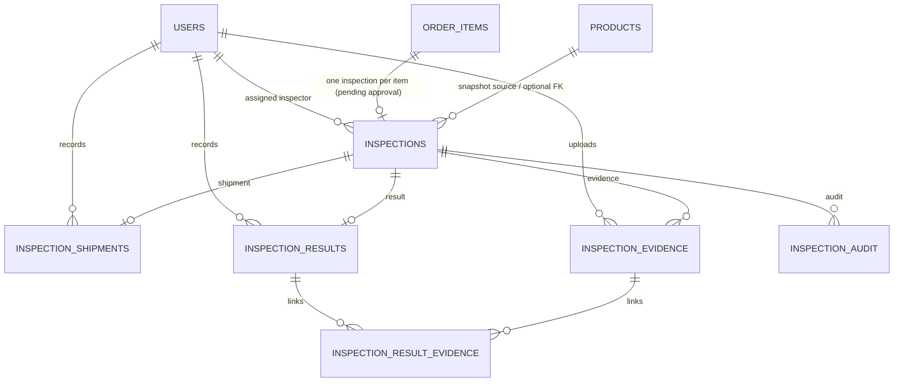

# INSPECT-01 ERD (pre-implementation)

สถานะเอกสาร: เตรียมงานตาม `inspect-01-implementation-plan.md` โดยอิง `inspect-contract.md` เวอร์ชัน 0.1-draft เท่านั้น

เอกสารนี้ยังไม่ใช่ schema ที่อนุมัติ และยังไม่ควรใช้สร้าง migration จนกว่า INSPECT-00 และ ORDER-01 จะส่งมอบ contract/model ที่ merge แล้ว

## External dependency boundary

`ORDER_ITEMS` เป็น dependency ที่ยังไม่มีใน checkout นี้ จึงเป็น boundary เท่านั้น ไม่ใช่คำสั่งให้สร้างตารางสมมติขึ้นมา `PRODUCTS` และ `USERS` มีอยู่ใน backend ปัจจุบัน แต่การเก็บ `product_id`/`seller_id` และการอ้าง snapshot ต้องให้ ORDER-01 ยืนยันก่อน

## Proposed inspection storage

| ตาราง | คีย์และความสัมพันธ์ | หมายเหตุที่ต้องยืนยัน |
|---|---|---|
| `inspections` | `id`; `order_item_id` FK + unique; optional product/seller references | หน่วยตรวจ, eligibility, snapshot และ delete policy มาจาก ORDER-01/Lead |
| `inspection_shipments` | `id`; `inspection_id` FK + unique; `recorded_by` FK `users.id` | หนึ่งการส่งเข้าศูนย์ต่อ inspection ตามร่าง |
| `inspection_results` | `id`; `inspection_id` FK + unique; `recorded_by` FK `users.id` | ผลเป็น immutable หลัง commit ตามร่าง; revision/CERT boundary ต้องยืนยัน |
| `inspection_evidence` | `id`; `inspection_id` FK; `uploaded_by` FK `users.id` | เก็บ private object key ไม่เก็บ signed URL ถาวร |
| `inspection_result_evidence` | `(result_id, evidence_id, inspection_id)` และ composite FKs | ป้องกันการแนบหลักฐานข้าม inspection |
| audit | ใช้ shared audit หรือ inspection-owned table | ห้ามสร้างซ้ำก่อน DB1/BE ระบุ owner |
| outbox/inbox/idempotency | ใช้ shared integration storage ถ้ามี | ขอบเขตและ unique key ต้องตกลงก่อน migration |

## Migration gate

ก่อนสร้าง model/migration ให้แนบหลักฐานต่อไปนี้ใน PR:

1. contract version ที่ Lead อนุมัติ พร้อมชื่อสถานะ ผล เหตุผล และกติกา 1 inspection ต่อ order item หรือ order
2. ORDER-01 commit ที่มี `orders`/`order_items` model และ migration จริง รวม seller/product snapshot และ eligibility policy
3. owner ของ audit, outbox, inbox deduplication และ idempotency storage
4. current Alembic head หลังรวม ORDER-01 และแผน migration ที่มี head เดียว
5. ผู้รับผิดชอบ DB1 สำหรับ staging/ฐานกลาง; ข้อมูลนี้ใช้ตอน rollout เท่านั้น ไม่ใช่การอนุมัติจากเอกสารนี้
