# VERIFY-00: ข้อตกลงการยืนยันตัวตนผู้ขาย

เอกสารนี้เป็นข้อตกลงกลางสำหรับ Feature **อนุมัติผู้ขาย** ตาม SRS ข้อ FR-04 และใช้เป็นจุดอ้างอิงของงาน VERIFY-01 ถึง VERIFY-06

## อ่านส่วนนี้ก่อน

- Wondee UX: บัญชีใหม่เริ่มเป็น `BUYER` และสมัครเปิดร้านจากหน้าโปรไฟล์ การอนุมัติคำขอล่าสุดจะตั้ง `APPROVED` และเปลี่ยน role เป็น `SELLER` ใน transaction เดียวกัน
- ผู้สมัครส่งชื่อร้าน รูปบัตรประชาชน 1 รูป ชื่อธนาคาร ชื่อบัญชี และเลขบัญชี
- Prototype และข้อมูลทดสอบต้องใช้ข้อมูลสมมติเท่านั้น ห้ามใช้บัตรประชาชนหรือบัญชีธนาคารจริง
- Admin ตรวจเอกสารด้วยตนเอง แล้วเลือกอนุมัติหรือปฏิเสธพร้อมเหตุผล
- ผู้ขายที่ถูกปฏิเสธแก้ข้อมูลและส่งคำขอใหม่ได้ ระบบเก็บคำขอเดิมไว้เป็นประวัติ
- ผู้ขายที่มีคำขอ `PENDING` หรือคำขอล่าสุดเป็น `APPROVED` ส่งซ้ำไม่ได้

## State flow

```mermaid
stateDiagram-v2
    [*] --> NOT_SUBMITTED: Active Buyer / legacy Seller
    NOT_SUBMITTED --> PENDING: Submit shop + private verification
    PENDING --> APPROVED: Admin approves latest / promote Seller atomically
    PENDING --> REJECTED: Admin rejects / role unchanged
    REJECTED --> PENDING: New request; keep history
```



ภาพ `.png`/`.puml` รุ่นเดิมใน `docs/diagrams` เป็นประวัติ flow ก่อน Wondee; ให้ยึด flow และสิทธิ์ในเอกสารนี้สำหรับ implementation ใหม่.

`NOT_SUBMITTED` ใช้เฉพาะใน API และหน้าจอเมื่อยังไม่มีคำขอ ไม่ได้เก็บในฐานข้อมูล ส่วนค่าที่เก็บจริงมี `PENDING`, `APPROVED` และ `REJECTED`

## สิทธิ์ของแต่ละบทบาท

| การทำงาน | BUYER / SELLER | ADMIN | INSPECTOR |
| --- | --- | --- | --- |
| ส่งคำขอ/อ่านสถานะตนเอง | ได้ เมื่อบัญชี `ACTIVE` | ไม่ได้ | ไม่ได้ |
| ดูคิว/เปิดรูปบัตร | ไม่ได้ | ได้ เมื่อบัญชี `ACTIVE`; รูปผ่านลิงก์ชั่วคราว | ไม่ได้ |
| อนุมัติหรือปฏิเสธ | ไม่ได้ | ได้ เมื่อบัญชีและผู้สมัครยัง `ACTIVE` | ไม่ได้ |
| ลงขายสินค้า | เฉพาะ `SELLER` และคำขอล่าสุด `APPROVED` | ไม่ได้ | ไม่ได้ |

Backend ตรวจ Token เพื่อระบุตัวตน แล้วอ่านบทบาทและสถานะบัญชีปัจจุบันจากฐานข้อมูล ห้ามเชื่อ `user_id`, role หรือสถานะที่ Mobile ส่งมา

## ข้อมูลที่ผู้ขายส่ง

`POST /verifications` ใช้ `multipart/form-data`

| Field | กติกา |
| --- | --- |
| `shop_name` | บังคับ ตัดช่องว่างหัวท้าย ความยาว 2–100 ตัวอักษร; คำขอเก่าอาจเป็น null |
| `bank_name` | บังคับ ความยาว 2-255 ตัวอักษร |
| `bank_account_name` | บังคับ ความยาว 2-255 ตัวอักษร |
| `bank_account_number` | บังคับ ระบบตัดขีดและช่องว่างออก แล้วต้องเหลือตัวเลข 10-15 หลัก |
| `id_card_image` | บังคับ รองรับ JPG, PNG หรือ WEBP ขนาดไม่เกิน 5 MB และตรวจชนิดจากเนื้อไฟล์ |

ชื่อไฟล์จริงและข้อมูลส่วนตัวต้องไม่ถูกนำไปใช้เป็น object key ใน Storage

## API contract

### ผู้สมัคร (Buyer / Seller)

| Method | Path | ผลลัพธ์ |
| --- | --- | --- |
| `GET` | `/verifications/me` | สถานะคำขอล่าสุดของผู้สมัครที่ Login |
| `POST` | `/verifications` | ส่งคำขอใหม่และได้สถานะ `PENDING` |

ตัวอย่างเมื่อยังไม่เคยส่ง:

```json
{
  "status": "NOT_SUBMITTED",
  "can_submit": true
}
```

ตัวอย่างเมื่อถูกปฏิเสธ:

```json
{
  "id": 42,
  "status": "REJECTED",
  "shop_name": "ร้านวนกลับ",
  "bank_name": "ธนาคารตัวอย่าง",
  "bank_account_name": "ผู้ขาย ทดสอบ",
  "bank_account_last4": "7890",
  "reject_reason": "รูปบัตรไม่ชัด กรุณาถ่ายใหม่",
  "can_submit": true
}
```

ผู้สมัครได้รับเลขบัญชีเพียง 4 ตัวท้าย และไม่ได้รับ path หรือ URL ของรูปบัตรกลับมา

### Admin

| Method | Path | ผลลัพธ์ |
| --- | --- | --- |
| `GET` | `/admin/verifications?status=PENDING&limit=20&offset=0` | รายการตามสถานะพร้อมจำนวนทั้งหมด |
| `GET` | `/admin/verifications/{id}` | รายละเอียดคำขอ โดยเลขบัญชีแสดงเฉพาะ 4 ตัวท้าย |
| `GET` | `/admin/verifications/{id}/id-card` | Signed URL ของรูปบัตร อายุ 120 วินาที |
| `POST` | `/admin/verifications/{id}/decision` | บันทึก `APPROVED` หรือ `REJECTED` |

ตัวอย่างการอนุมัติ:

```json
{
  "decision": "APPROVED"
}
```

ตัวอย่างการปฏิเสธ:

```json
{
  "decision": "REJECTED",
  "reject_reason": "รูปบัตรไม่ชัด กรุณาถ่ายใหม่"
}
```

การส่งและการตรวจล็อกแถว User ก่อนคำขอ พร้อมอ่าน role/status ใหม่ การเลือกคำขอล่าสุดใช้ `created_at DESC, id DESC` ตรงกับ product eligibility และ public seller projection คำขอที่ไม่ใช่ล่าสุดได้ `409 stale_verification` ไม่มีการเปลี่ยน role จากการ submit/reject และไม่มีการอนุมัติเพียงครึ่งเดียวหาก commit ล้มเหลว

เหตุผลปฏิเสธต้องมี 5-500 ตัวอักษร หาก Admin สองคนตรวจคำขอเดียวกันพร้อมกัน จะสำเร็จเพียงคนเดียว อีกคนได้รับ `409 already_reviewed` พร้อมชื่อผู้ตรวจคนแรก

## รหัสตอบกลับที่ทีมต้องรองรับ

| HTTP | กรณี |
| --- | --- |
| `401` | ไม่มี Token, Token ผิด หรือหมดอายุ |
| `403` | บทบาทไม่ตรง หรือบัญชีไม่ `ACTIVE` |
| `404` | ไม่พบคำขอหรือไม่มีรูปบัตร |
| `409` | ผู้สมัครส่งซ้ำ / คำขอไม่ใช่ล่าสุด / ถูก Admin คนอื่นตรวจแล้ว |
| `422` | ข้อมูลหรือไฟล์ไม่ผ่าน validation |
| `502` | อัปโหลดหรือเปิดรูปจาก Storage ไม่สำเร็จ |
| `503` | Backend ยังไม่ได้ตั้งค่า private Storage |

ข้อความที่แสดงแก่ผู้ใช้ใช้ภาษาไทย และ Log ห้ามมี Token, เลขบัญชีเต็ม, Storage path หรือ Signed URL

## การเก็บข้อมูลและความปลอดภัย

- รูปบัตรเก็บใน Supabase Storage bucket แบบ private ชื่อเริ่มต้น `seller-verifications`
- Service role key อยู่ฝั่ง Backend เท่านั้น ห้ามใส่ใน Mobile, `EXPO_PUBLIC_*`, Log หรือ Git
- Admin ต้องกดเปิดรูปก่อน Backend จึงออก Signed URL อายุสั้น
- รายการ Admin และรายละเอียดคำขอไม่ส่งเลขบัญชีเต็มหรือ Storage path
- ตาราง `verifications` มี unique partial index เพื่อให้หนึ่ง Seller มีคำขอ `PENDING` ได้ครั้งละหนึ่งใบ แม้กดส่งพร้อมกันจากหลายอุปกรณ์
- คำขอ `REJECTED` เก็บเป็นประวัติ เมื่อส่งใหม่ Backend สร้างแถวใหม่เป็น `PENDING`
- `purge_at` ถูกตั้งไว้ 90 วันหลังส่งคำขอใน implementation ปัจจุบัน

## Acceptance criteria ของ VERIFY-00

- [x] ทีมรู้ข้อมูลที่ Mobile ต้องส่งและข้อมูลที่ API ตอบ
- [x] กำหนดสถานะและ transition ที่ใช้ร่วมกัน
- [x] กำหนดสิทธิ์ Seller และ Admin ฝั่ง Backend
- [x] กำหนด validation ของข้อมูลและรูป
- [x] กำหนดวิธีป้องกันส่งซ้ำและ Admin บันทึกผลทับกัน
- [x] กำหนดขอบเขตข้อมูลที่ Mobile และ Admin มองเห็น
- [x] มี State Diagram ที่ทีมเปิดดูบน GitHub ได้

## งานที่ยังต้องตามต่อ

หัวข้อนี้แยก “ข้อตกลงที่ต้องการ” ออกจากสิ่งที่มีใน `main` เพื่อไม่ให้ทีมเข้าใจว่าเสร็จแล้ว:

- SRS NFR-05 กำหนดให้ขอความยินยอมก่อนเก็บสำเนาบัตร แต่ implementation ปัจจุบันยังไม่มี `Consent` flow
- Class Diagram ระบุ `Seller 1 -- 0..1 SellerVerification` แต่ implementation ปัจจุบันเก็บหลายแถวเพื่อรักษาประวัติการส่งใหม่ โดยบังคับเพียงหนึ่ง `PENDING` ต่อ Seller เอกสารนี้ยึด behavior ใน tests และ code ตามกติกา repository
- ยังไม่มี `AuditLog` สำหรับเหตุการณ์ส่งคำขอและตรวจคำขอ
- ยังไม่มีงานอัตโนมัติที่ลบรูปเมื่อถึง `purge_at`
- API ลงขายสินค้าตรวจ `SELLER` + บัญชี `ACTIVE` + คำขอล่าสุด `APPROVED` แล้ว; device และ Storage integration ดูสถานะจริงในรายงานส่งมอบ Wondee

## เอกสารทดสอบที่เกี่ยวข้อง

- [ทดสอบหน้าส่งคำขอของ Seller](../../mobile/docs/testing/seller-verification.md)
- [ทดสอบหน้าตรวจคำขอของ Admin](../../mobile/docs/testing/admin-verification-review.md)

## Migration และ compatibility ของ Wondee

Revision `19d4be72a610` ต่อจาก `c93b7e5a1d84`: เพิ่ม `shop_name` nullable สำหรับคำขอเก่า, constraint ชื่อที่ไม่เป็น null ต้อง trim แล้วและยาว 2–100, normalize role null เป็น BUYER และตั้ง DB default BUYER โดยไม่แก้ Seller/Admin/Inspector เดิม

Downgrade เอา shop_name และ default ออก แต่ **ไม่ย้อน BUYER กลับ null** เพราะไม่สามารถแยกบัญชีเดิมกับบัญชีใหม่อย่างปลอดภัย การ upgrade/downgrade ใช้ PostgreSQL ทดสอบแยกแล้ว; ยังไม่ได้รันกับฐานข้อมูลร่วม และต้องตรวจ migration graph อีกครั้งเมื่อรวม INSPECT/CERT

Client เก่าที่ไม่ส่ง shop_name จะได้ `422` จึงต้องปล่อย backend/mobile ที่เข้ากันได้พร้อมกัน ดู role-route compatibility และ seller-as-buyer ใน [UX-01](UX-01-wondee-marketplace.md), ผลทดสอบใน [รายงานส่งมอบ](WONDEE-UI-REDESIGN-DELIVERY.md)
