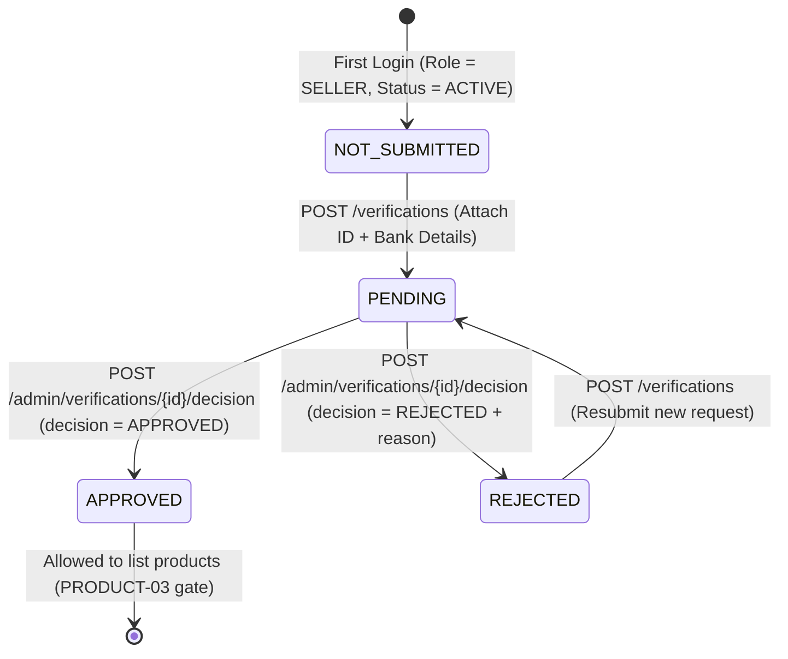
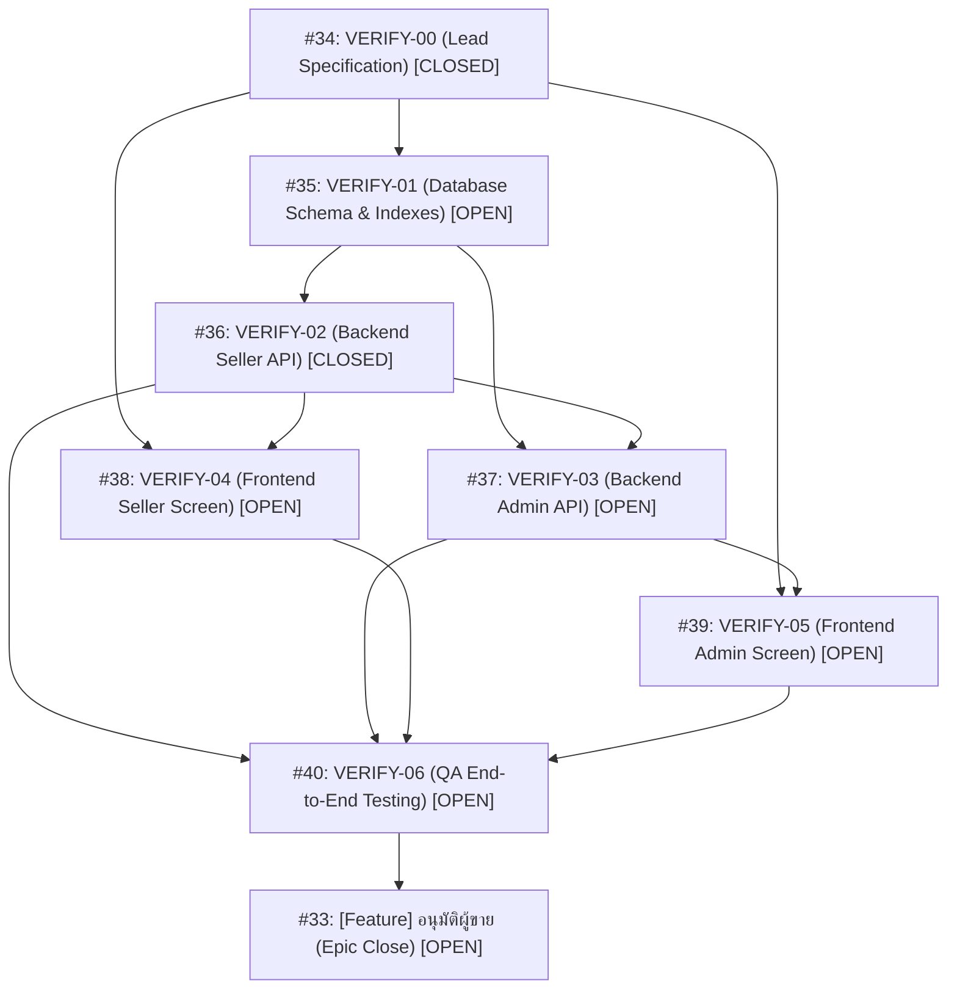

# Seller Verification (VERIFY) — AI Task & Specification Manifest

This document is optimized for consumption by AI coding agents, autonomous planners, and LLMs. It defines the complete state machine, RBAC constraints, API/DB contracts, dependency DAG, and individual issue specifications for the **Seller Verification** feature in [`naithammarak/SA-Project`](https://github.com/naithammarak/SA-Project).

---

## 1. System Architecture & Core Specifications

### 1.1 State Machine



#### State Definitions & Invariants:
- `NOT_SUBMITTED` (Virtual / Client-API only): The seller exists with role `SELLER` and account `ACTIVE`, but has no record in the `verifications` table.
- `PENDING` (DB persisted): Application submitted and awaiting admin manual review.
  - **Constraint:** At most **one** `PENDING` record per `user_id` is allowed at any given time (enforced via database unique partial index).
- `APPROVED` (DB persisted): Admin approved the application. The seller is unlocked to create product listings. Resubmission is permanently disabled.
- `REJECTED` (DB persisted): Admin rejected the application with a mandatory reason (5–500 chars). The previous record remains in database history, and the seller is allowed to create a **new** application row.

---

### 1.2 Role-Based Access Control (RBAC) Matrix

All authentication identity and roles MUST be derived from verified Supabase JWTs on FastAPI (`/backend`). Client-supplied `user_id`, `role`, or `status` headers/body fields must be strictly ignored.

| Action / Resource | Endpoint | SELLER (ACTIVE) | ADMIN (ACTIVE) | BUYER / INSPECTOR | INACTIVE / BANNED |
|---|---|:---:|:---:|:---:|:---:|
| Submit verification request | `POST /verifications` | **ALLOW** | 403 Forbidden | 403 Forbidden | 403 Forbidden |
| Read my verification status | `GET /verifications/me` | **ALLOW** | 403 Forbidden | 403 Forbidden | 403 Forbidden |
| List verification queue | `GET /admin/verifications` | 403 Forbidden | **ALLOW** | 403 Forbidden | 403 Forbidden |
| View application details | `GET /admin/verifications/{id}` | 403 Forbidden | **ALLOW** | 403 Forbidden | 403 Forbidden |
| Request signed ID card URL | `GET /admin/verifications/{id}/id-card` | 403 Forbidden | **ALLOW** (120s TTL) | 403 Forbidden | 403 Forbidden |
| Review / Decide application | `POST /admin/verifications/{id}/decision` | 403 Forbidden | **ALLOW** | 403 Forbidden | 403 Forbidden |

---

### 1.3 Database Model Contract (`backend/app/models/verification.py`)

- **Table Name:** `verifications`
- **Primary Key:** `id: Integer`
- **Columns:**
  - `user_id`: `Integer`, FK -> `users.id`, `nullable=False`
  - `id_card_image_url`: `String(500)`, `nullable=False` (Internal storage key or private bucket path)
  - `bank_account_name`: `String(255)`, `nullable=False`
  - `bank_account_number`: `String(50)`, `nullable=False` (Digits only, stripped of dashes/spaces)
  - `bank_name`: `String(255)`, `nullable=False`
  - `verification_status`: `String(20)`, `nullable=False` (`PENDING`, `APPROVED`, `REJECTED`)
  - `created_at`: `DateTime(timezone=True)`, default `func.now()`, `nullable=False`
  - `verified_at`: `DateTime(timezone=True)`, `nullable=True` (Timestamp of decision)
  - `reviewed_at`: `DateTime(timezone=True)`, `nullable=True`
  - `reviewed_by`: `Integer`, FK -> `users.id`, `nullable=True` (Admin user ID who reviewed)
  - `reject_reason`: `String(500)`, `nullable=True` (Mandatory if `REJECTED`)
  - `purge_at`: `DateTime(timezone=True)`, `nullable=True` (Set to `created_at + 90 days`)
- **Index Constraints:**
  - Unique Partial Index: `uq_verifications_user_pending` ON `verifications(user_id)` WHERE `verification_status = 'PENDING'`.

---

### 1.4 API Contracts

#### Seller Endpoints:
1. `GET /verifications/me`
   - **Auth:** Bearer Token (Role: `SELLER`)
   - **Responses:**
     - 200 OK (Not submitted): `{"status": "NOT_SUBMITTED", "can_submit": true}`
     - 200 OK (Pending): `{"id": 42, "status": "PENDING", "bank_name": "...", "bank_account_name": "...", "bank_account_last4": "7890", "can_submit": false}`
     - 200 OK (Approved): `{"id": 42, "status": "APPROVED", "bank_name": "...", "bank_account_name": "...", "bank_account_last4": "7890", "can_submit": false}`
     - 200 OK (Rejected): `{"id": 42, "status": "REJECTED", "bank_name": "...", "bank_account_name": "...", "bank_account_last4": "7890", "reject_reason": "...", "can_submit": true}`
     - 401 Unauthorized: Invalid or missing token
     - 403 Forbidden: User role is not `SELLER` or user account is not `ACTIVE`
2. `POST /verifications`
   - **Auth:** Bearer Token (Role: `SELLER`)
   - **Content-Type:** `multipart/form-data`
   - **Fields:**
     - `bank_name`: string (2-255 chars)
     - `bank_account_name`: string (2-255 chars)
     - `bank_account_number`: string (10-15 digits after stripping hyphens/whitespace)
     - `id_card_image`: binary (JPG, PNG, WEBP, max 5MB, mime-type verified from file magic bytes)
   - **Responses:**
     - 201 Created: `{"id": 43, "status": "PENDING", ...}`
     - 409 Conflict: Already has `PENDING` request or latest is `APPROVED`
     - 422 Unprocessable Entity: Validation errors

#### Admin Endpoints:
1. `GET /admin/verifications?status=PENDING&limit=20&offset=0`
   - **Auth:** Bearer Token (Role: `ADMIN`)
   - **Responses:** 200 OK: `{"total": 1, "items": [{"id": 42, "user_id": 10, "bank_name": "...", "bank_account_last4": "7890", "status": "PENDING", "created_at": "..."}]}`
2. `GET /admin/verifications/{id}`
   - **Auth:** Bearer Token (Role: `ADMIN`)
   - **Responses:** 200 OK (Masked details, bank_account_number only returns `last4`)
3. `GET /admin/verifications/{id}/id-card`
   - **Auth:** Bearer Token (Role: `ADMIN`)
   - **Responses:** 200 OK: `{"image_url": "https://storage.../seller-verifications/...?token=...", "expires_in": 120}`
4. `POST /admin/verifications/{id}/decision` (or `/review`)
   - **Auth:** Bearer Token (Role: `ADMIN`)
   - **Payload Schema:**
     - If approved: `{"decision": "APPROVED"}`
     - If rejected: `{"decision": "REJECTED", "reject_reason": "string (5-500 chars)"}`
   - **Responses:**
     - 200 OK: `{"id": 42, "status": "APPROVED"|"REJECTED", ...}`
     - 404 Not Found: Request ID does not exist
     - 409 Conflict: `already_reviewed` (Another admin reviewed it concurrently)

---

## 2. Dependency Graph (DAG) & Topological Execution Order



### Recommended Implementation Sequence:
1. `VERIFY-00` (#34) — Lead Spec & Agreement *(DONE / MERGED in PR #75)*
2. `VERIFY-01` (#35) — Database Migration & Partial Unique Index *(Prerequisite for Backend)*
3. `VERIFY-02` (#36) — Backend Seller API (`POST /verifications`, `GET /verifications/me`)
4. `VERIFY-03` (#37) — Backend Admin API (`GET /admin/verifications`, `POST .../decision`, signed URL)
5. `VERIFY-04` (#38) — Mobile Seller Screen (`mobile/src/app/seller-verification.tsx`)
6. `VERIFY-05` (#39) — Mobile Admin Screen (`mobile/src/app/admin-verifications.tsx`)
7. `VERIFY-06` (#40) — QA Automated & Manual Test Cases (Integration verification)
8. `VERIFY-EPIC` (#33) — Epic validation, demo acceptance, and sign-off

---

## 3. Machine-Readable Issue Catalog

```yaml
issues_catalog:
  - id: 33
    code: "VERIFY-EPIC"
    type: "epic"
    title: "[Feature] อนุมัติผู้ขาย"
    status: "OPEN"
    url: "https://github.com/naithammarak/SA-Project/issues/33"
    created_at: "2026-09-17T17:02:09Z"
    updated_at: "2026-09-17T17:02:09Z"
    assignees: []
    dependencies: ["VERIFY-00", "VERIFY-01", "VERIFY-02", "VERIFY-03", "VERIFY-04", "VERIFY-05", "VERIFY-06"]
    affected_paths:
      - "backend/app/"
      - "mobile/src/"
      - "docs/features/"
    goal: "Seller sends application -> Admin approves/rejects -> Seller sees status and rejection reason. Backend strictly enforces authorization."
    acceptance_criteria:
      - "VERIFY-00 to VERIFY-06 pass acceptance criteria."
      - "Full mobile demo for both Approval flow and Rejection-then-Resubmit flow."
      - "Zero horizontal privilege escalation: users cannot view others' applications or approve themselves."
      - "Integration with real backend API and PostgreSQL database with test proofs."

  - id: 34
    code: "VERIFY-00"
    type: "lead_architecture"
    title: "VERIFY-00 — [Lead] ตกลงข้อมูลและกติกาการอนุมัติผู้ขาย"
    status: "CLOSED"
    url: "https://github.com/naithammarak/SA-Project/issues/34"
    created_at: "2026-09-17T17:03:16Z"
    updated_at: "2026-09-19T12:05:43Z"
    assignees: []
    owner: "Lead"
    helpers: ["BE", "DB1", "FE1", "FE2"]
    dependencies: []
    resolved_by_pr: 75
    documentation_path: "docs/features/VERIFY-00-seller-verification.md"
    diagram_path: "docs/diagrams/seller-verification-state.png"
    acceptance_criteria:
      - "FE, BE, DB, and QA share unified spec on data fields, states, RBAC, and proofs."
      - "Data and image validation limits established (5MB, 10-15 bank digits)."
      - "Concurrent review conflict handling established (409 already_reviewed)."

  - id: 35
    code: "VERIFY-01"
    type: "database"
    title: "VERIFY-01 — [Database] ตรวจและปรับตารางคำขอยืนยันผู้ขาย"
    status: "OPEN"
    url: "https://github.com/naithammarak/SA-Project/issues/35"
    created_at: "2026-09-17T17:03:39Z"
    updated_at: "2026-09-19T12:08:18Z"
    assignees: []
    owner: "DB1"
    reviewer: "DB2"
    dependencies: ["VERIFY-00"]
    affected_paths:
      - "backend/app/models/verification.py"
      - "backend/migrations/versions/"
    tasks:
      - "Audit existing models and migrations before making changes."
      - "Add missing fields: created_at, reviewed_at, reviewed_by, purge_at."
      - "Create partial unique index on verifications(user_id) WHERE verification_status = 'PENDING'."
      - "Preserve historical rejected records when a seller resubmits."
      - "Ensure migration upgrades and downgrades without dropping existing production data."
    acceptance_criteria:
      - "Record stores applicant, review status, reviewer ID, timestamps, and reason."
      - "Duplicate PENDING requests from the same user are rejected at DB level (uq_verifications_user_pending)."
      - "Alembic migration passes automated tests."

  - id: 36
    code: "VERIFY-02"
    type: "backend_seller_api"
    title: "VERIFY-02 — [Backend] ส่งคำขอและอ่านสถานะของผู้ขาย"
    status: "CLOSED"
    url: "https://github.com/naithammarak/SA-Project/issues/36"
    created_at: "2026-09-17T17:03:57Z"
    updated_at: "2026-09-17T17:03:57Z"
    assignees: []
    owner: "BE"
    helpers: ["DB1"]
    dependencies: ["VERIFY-00", "VERIFY-01", "LOGIN_AUTH"]
    affected_paths:
      - "backend/app/api/verifications.py"
      - "backend/app/services/verification_service.py"
      - "backend/app/schemas/verification.py"
      - "backend/tests/"
    proposed_apis:
      - "POST /verifications"
      - "GET /verifications/me"
    tasks:
      - "Extract user identity and role solely from verified JWT token."
      - "Enforce role == 'SELLER' and account status == 'ACTIVE'."
      - "Validate bank_name (2-255), bank_account_name (2-255), bank_account_number (10-15 digits)."
      - "Validate id_card_image: JPG/PNG/WEBP, <= 5MB, verify magic bytes, store in private bucket."
      - "Prevent resubmission when status is PENDING or APPROVED."
      - "Allow resubmission when latest status is REJECTED by creating a new database row."
      - "Mask bank account number (return only bank_account_last4) and omit storage paths to client."
    acceptance_criteria:
      - "Valid submission returns 201 with status PENDING."
      - "Seller can read only their own application status via GET /verifications/me."
      - "Unit/Integration tests cover invalid payload, missing token, unauthorized role, duplicate submit, and race conditions."

  - id: 37
    code: "VERIFY-03"
    type: "backend_admin_api"
    title: "VERIFY-03 — [Backend] API อนุมัติและปฏิเสธผู้ขาย"
    status: "OPEN"
    url: "https://github.com/naithammarak/SA-Project/issues/37"
    created_at: "2026-09-17T17:04:22Z"
    updated_at: "2026-09-17T17:04:22Z"
    assignees: []
    owner: "BE"
    dependencies: ["VERIFY-01", "VERIFY-02"]
    affected_paths:
      - "backend/app/api/admin_verifications.py"
      - "backend/app/schemas/admin_verification.py"
      - "backend/tests/"
    proposed_apis:
      - "GET /admin/verifications?status=PENDING&limit=20&offset=0"
      - "GET /admin/verifications/{id}"
      - "GET /admin/verifications/{id}/id-card"
      - "POST /admin/verifications/{id}/decision"
    tasks:
      - "Enforce role == 'ADMIN' and account status == 'ACTIVE' on all endpoints."
      - "Implement paginated list of applications by status."
      - "Generate short-lived signed URL for id_card_image (120 seconds TTL)."
      - "Accept APPROVED or REJECTED decisions; require reject_reason (5-500 chars) if REJECTED."
      - "Record reviewed_by (admin user ID) and reviewed_at server timestamp."
      - "Enforce optimistic locking / atomic state check: transition only allowed if current status is PENDING."
      - "If two admins submit decisions simultaneously, first succeeds, second receives 409 Conflict (already_reviewed)."
    acceptance_criteria:
      - "Admin can list, inspect details, view image via signed URL, and decide applications."
      - "Non-admin roles (BUYER, SELLER, INSPECTOR) receive 403 Forbidden."
      - "Concurrent reviews do not overwrite each other or corrupt state."

  - id: 38
    code: "VERIFY-04"
    type: "frontend_seller_ui"
    title: "VERIFY-04 — [Frontend] หน้าส่งคำขอและติดตามผลสำหรับ Seller"
    status: "OPEN"
    url: "https://github.com/naithammarak/SA-Project/issues/38"
    created_at: "2026-09-17T17:04:42Z"
    updated_at: "2026-09-19T23:22:00Z"
    assignees: ["Nathadon"]
    owner: "FE1"
    dependencies: ["VERIFY-00", "VERIFY-02"]
    affected_paths:
      - "mobile/src/app/seller-verification.tsx"
      - "mobile/src/components/"
      - "mobile/src/services/"
      - "mobile/tests/"
    tasks:
      - "Add navigation entry to verification screen for SELLER users after login."
      - "Implement verification form: bank name, account name, account number, ID card image picker."
      - "Provide field-level validation and error messages in Thai."
      - "Handle all 4 visual states: NOT_SUBMITTED, PENDING, APPROVED, REJECTED."
      - "Display rejection reason and a clear button to edit & resubmit if REJECTED."
      - "Prevent duplicate submissions while request is in flight (disable submit button, show spinner)."
      - "Handle loading, network failure retry, pull-to-refresh."
      - "Clear local verification state completely on logout or account switch."
    acceptance_criteria:
      - "Seller submits application and sees live status from API (Automated component & store proof closed; awaiting live-backend & real-device verification under VERIFY-06)."
      - "State matches backend after app restart."
      - "Zero state leakage between user accounts after switching."

  - id: 39
    code: "VERIFY-05"
    type: "frontend_admin_ui"
    title: "VERIFY-05 — [Frontend] หน้าตรวจคำขอสำหรับ Admin"
    status: "OPEN"
    url: "https://github.com/naithammarak/SA-Project/issues/39"
    created_at: "2026-09-17T17:04:50Z"
    updated_at: "2026-09-19T22:19:00Z"
    assignees: ["Nathadon"]
    owner: "FE2"
    dependencies: ["VERIFY-00", "VERIFY-03"]
    affected_paths:
      - "mobile/src/app/admin-verifications.tsx"
      - "mobile/src/components/"
      - "mobile/src/services/"
      - "mobile/tests/"
    tasks:
      - "Render Admin verification queue route only if user role == 'ADMIN'."
      - "Display list of pending verification requests with applicant summary."
      - "Detail view displaying masked bank info (last 4 digits) and ID card image."
      - "Approval action button and Rejection action button with mandatory reason input."
      - "Prevent duplicate action submission; refresh list upon successful decision."
      - "Handle empty queue state, network failure, and 409 already_reviewed conflict notification."
    acceptance_criteria:
      - "Admin can review and submit APPROVED and REJECTED decisions against live backend (Automated component & store proof closed; awaiting live-backend & real-device verification under VERIFY-06)."
      - "Submitting rejection without a reason is blocked in UI."
      - "Non-admin accounts cannot access or view verification data."

  - id: 40
    code: "VERIFY-06"
    type: "qa_integration"
    title: "VERIFY-06 — [QA] เตรียมข้อมูลและทดสอบอนุมัติผู้ขายครบเส้นทาง"
    status: "OPEN"
    url: "https://github.com/naithammarak/SA-Project/issues/40"
    created_at: "2026-09-17T17:04:58Z"
    updated_at: "2026-09-17T17:04:58Z"
    assignees: []
    owner: "QA1"
    helpers: ["DB2", "QA2"]
    dependencies: ["VERIFY-00", "VERIFY-02", "VERIFY-03", "VERIFY-04", "VERIFY-05"]
    affected_paths:
      - "backend/test-data/"
      - "backend/tests/"
      - "mobile/docs/testing/"
    tasks:
      - "Prepare synthetic test accounts for all 4 states: NOT_SUBMITTED, PENDING, APPROVED, REJECTED."
      - "Use synthetic mock ID card images and mock bank account data."
      - "API Test Suite: invalid data, missing bearer token, wrong roles, reading other users' data, duplicate submit."
      - "Concurrency Test: race condition on simultaneous seller submits and simultaneous admin reviews."
      - "Mobile E2E Flow 1: Submit -> Admin Approve -> Pull-to-refresh -> Status APPROVED."
      - "Mobile E2E Flow 2: Submit -> Admin Reject -> See reason -> Fix & Resubmit -> Status PENDING."
      - "Session Test: Logout, switch accounts, network drop simulation."
    acceptance_criteria:
      - "Both primary flows pass on real mobile device and match PostgreSQL database."
      - "Zero authorization bypass, data leakage, or duplicate records under concurrency."
      - "Lead demo approved and signed off."
```

---

## 4. Key Implementation Guardrails for AI Agents

1. **Security & Secrets**:
   - Supabase Service Role Key must strictly reside in `backend/.env`. Never expose in mobile client code or git.
   - PII protection: Never return full bank account numbers in API responses (use `bank_account_last4` only).
   - ID card images must be stored in a private bucket (`seller-verifications`) and accessed only via short-lived signed URLs (120 seconds TTL).
2. **Database Invariants**:
   - Never remove or rewrite migrations that might have run. Create new Alembic revisions in `backend/migrations/versions/`.
   - Ensure the unique partial index `uq_verifications_user_pending` is enforced in PostgreSQL.
3. **API Contracts**:
   - `POST /verifications` must be `multipart/form-data`.
   - Reject reason is mandatory for `REJECTED` decisions (length 5–500 characters).
4. **Subsequent Features Gate**:
   - Product listing (`PRODUCT-03`) MUST query the seller's verification status and allow creation only if latest status is `APPROVED`.
