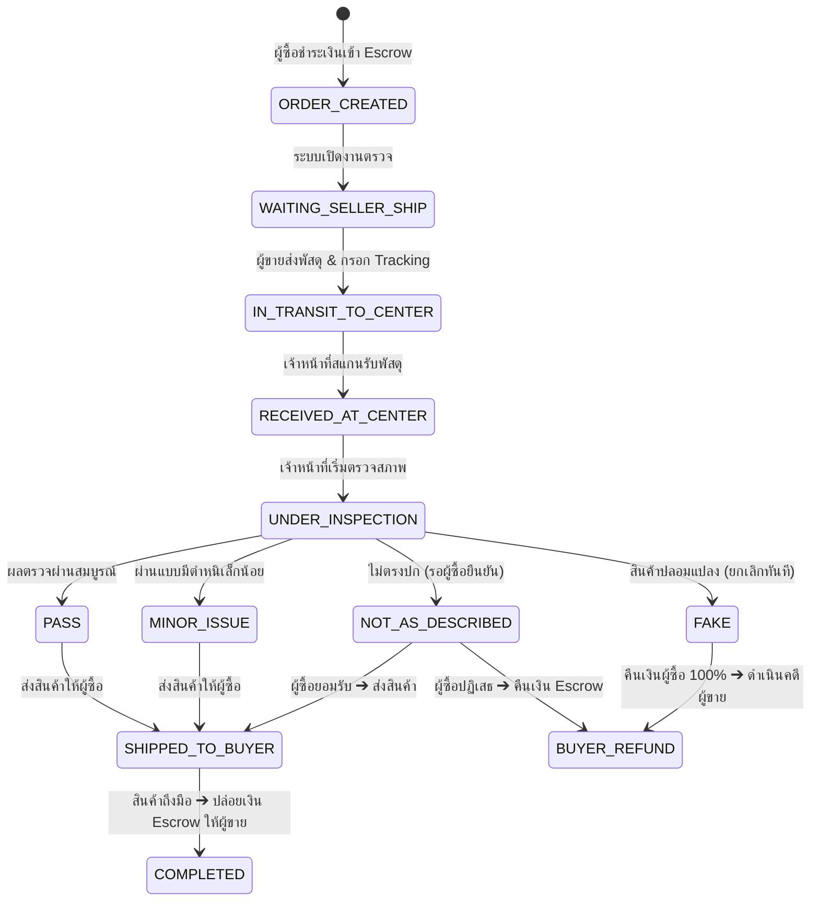

# Wondee Marketplace — Production UI/UX Design Specification
## คู่มือสเปกการออกแบบและพัฒนาสำหรับ Mobile App (React Native / Expo), Backend API และ QA

---

> **เวอร์ชัน:** 2.0 (Production-Ready Spec)  
> **วันที่มีผลบังคับใช้:** กันยายน 2026  
> **ไฟล์ต้นแบบอินเตอร์แอคทีฟ (Interactive Prototype):** [index.html](file:///home/tmk/Downloads/wondee-mobile-prototype/index.html)  
> **ชุดแสดงผลมาสคอต (Mascot Showcase):** [mascot_showcase.html](file:///home/tmk/Downloads/wondee-mobile-prototype/mascot_showcase.html)  
> **แพ็กเกจส่งต่อทีมงาน:** `/home/tmk/Downloads/wondee-mobile-prototype.zip`

---

## 1. บทนำและสถาปัตยกรรมระบบ (Executive Architecture)

### 1.1 วัตถุประสงค์
เอกสารฉบับนี้กำหนดมาตรฐานการออกแบบ UI/UX, โครงสร้าง Design Tokens, คอมโพเนนต์หน้าจอ (Screens), แอนิเมชันมาสคอต, โฟลว์การตรวจสอบสินค้า (Inspection System) และ Data Models เพื่อให้ทีมพัฒนา Frontend (React Native / Expo), Backend (FastAPI / PostgreSQL) และ QA สามารถนำไป Implement ใช้งานจริงได้อย่างถูกต้อง แม่นยำ และมีมาตรฐานสากล

### 1.2 Tech Stack Alignment
- **Mobile Framework:** React Native 0.86+ / Expo SDK 57 (Expo Router v4 File-based routing)
- **Styling / Theming:** NativeWind / Tailwind CSS + Reanimated 4.x
- **Typography:** `Plus Jakarta Sans` / `Prompt` (รองรับภาษาไทยคมชัด)
- **Vector Assets:** React Native SVG (`react-native-svg`) แบบ Inline 100% (ไร้ปัญหาเน็ตหลุด)
- **Backend / DB:** FastAPI (Python 3.12+), PostgreSQL, SQLAlchemy 2.0, Alembic
- **State & Caching:** TanStack Query (React Query) + Zustand

---

## 2. Design Tokens & Visual Hierarchy

### 2.1 Color Palette Matrix (WCAG AAA Standards)

| Design Token | Dark Mode (Default) | Light Mode | บทบาทและการใช้งาน |
| :--- | :--- | :--- | :--- |
| `canvas.base` | `#0c0e14` | `#f8fafc` | พื้นหลังของหน้าจอทั้งหมด (Screen Background) |
| `surface.card` | `#161b26` | `#ffffff` | การ์ดสินค้า, การ์ดโปรไฟล์, โมดอล |
| `surface.container`| `#0f131c` | `#f1f5f9` | ช่องใส่ข้อมูล, พื้นหลังตารางข้อมูลย่อย |
| `surface.elevated` | `#1e2433` | `#ffffff` | การ์ดลอย, เมนู Bottom Navigation Bar |
| `border.subtle` | `#1e293b` | `#e2e8f0` | เส้นแบ่งขอบบาง (1px Border) คมชัด |
| `border.focused` | `#10b981` | `#059669` | เส้นขอบเมื่อแตะหรือ Active |
| `brand.primary` | `#10b981` | `#059669` | สีแบรนด์หลัก (ปุ่ม CTA, ราคาเน้น, สัญลักษณ์ยืนยัน) |
| `brand.secondary`| `#0f766e` | `#0d9488` | สีแบรนด์รอง (ไอคอนศูนย์ตรวจ, ป้ายบอกหมวด) |
| `brand.gradient` | `#064e3b` ➔ `#10b981` | `#064e3b` ➔ `#10b981` | แถบ Progress Bar ตรวจสอบสภาพสินค้า |
| `text.primary` | `#f8fafc` | `#0f172a` | ข้อความสำคัญ, หัวข้อ, ตัวเลขราคา |
| `text.secondary` | `#94a3b8` | `#64748b` | รายละเอียดรอง, วันที่, คำอธิบายย่อย |
| `text.muted` | `#64748b` | `#94a3b8` | Placeholder, ตัวอักษรที่ไม่เน้น |
| `status.success` | `#10b981` | `#059669` | ผ่านการตรวจ (PASS), จัดส่งสำเร็จ |
| `status.warning` | `#f59e0b` | `#d97706` | มีตำหนิเล็กน้อย (MINOR_ISSUE), รอส่งสินค้า |
| `status.danger` | `#ef4444` | `#dc2626` | ของปลอม (FAKE), ยกเลิกคำสั่งซื้อ |
| `status.info` | `#06b6d4` | `#0891b2` | สินค้าไม่ตรงปก (NOT_AS_DESCRIBED), กำลังตรวจ |

### 2.2 Typography Scale (Scale 1.250 — Major Third)

| ระดับ | ขนาด (pt/sp) | Line Height | น้ำหนัก (Font Weight) | การใช้งาน |
| :--- | :--- | :--- | :--- | :--- |
| `Display` | 28px | 34px | 800 (Bold / ExtraBold) | หัวข้อใหญ่หน้าโปรไฟล์, แบนเนอร์ผลตรวจ |
| `H1` | 22px | 28px | 700 (Bold) | ชื่อสินค้าหน้ารายละเอียด, ผลการตรวจ E-Cert |
| `H2` | 18px | 24px | 700 (Bold) | หัวข้อการ์ด, ชื่อร้านค้า, หมวดหมู่หลัก |
| `H3` | 16px | 22px | 600 (SemiBold) | หัวข้อฟอร์ม, ชื่อตัวเลือกการส่ง |
| `Body` | 14px | 20px | 400 (Regular) / 500 (Medium) | ข้อความทั่วไป, คำอธิบายสินค้า, รายงาน |
| `Caption` | 12px | 16px | 500 (Medium) | ป้ายกำกับ, ตัวนับจำนวน, วันที่, ค่าธรรมเนียม |
| `Micro` | 10px | 14px | 600 (SemiBold) | ตรายืนยันตัวตน, Badge หมวดหมู่ |

### 2.3 Form Input High-Contrast Standard (Cross-Theme Protection)
**ข้อกำหนดบังคับสำหรับทีมพัฒนา (ป้องกันบัคตัวหนังสือจม):**
- **Dark Mode:** บังคับพื้นหลัง `backgroundColor: '#1e293b'`, ขอบ `borderColor: '#334155'`, สีตัวอักษร `color: '#f8fafc'`, placeholder `color: '#64748b'`
- **Light Mode:** บังคับพื้นหลัง `backgroundColor: '#ffffff'`, ขอบ `borderColor: '#cbd5e1'`, สีตัวอักษร `color: '#0f172a'`, placeholder `color: '#94a3b8'`
- **Focus State:** ขอบเปลี่ยนเป็น `#10b981` พร้อม Shadow อ่อน 3px

### 2.4 Skeleton Shimmer Sweep Specification
- **ระยะเวลาการกวาด (Sweep Duration):** `1.4s` Infinite Ease-in-out
- **มิติแสงกวาด:** ไล่ระดับสี 3 จุด (0% Transparent ➔ 50% High-Contrast Beam ➔ 100% Transparent)
- **Dark Theme:** ฐาน Slate-800 (`#1e293b`), คลื่นแสง `rgba(255, 255, 255, 0.18)`
- **Light Theme:** ฐาน Slate-300 (`#cbd5e1`), คลื่นแสง `rgba(255, 255, 255, 0.95)`

---

## 3. Mascot Design & Motion Specs (ระบบมาสคอตเรขาคณิต)

### 3.1 มาสคอตหลักประจำแอป (Core Mascot DNA)
- **อัตลักษณ์รูปทรง (Geometry):** ทรงเรขาคณิตโค้งมน (Geometric Drop) ดัดแปลงมาจากโลโก้ Wondee (วงแหวนสีมรกต `#10b981` และปลายยอดใบไม้มินต์ `#00baa7`)
- **ใบหน้า (Facial Features):** จุดตาสองจุด (Dot Eyes) สีเข้ม `#022c22`
- **อัตราส่วน (Aspect Ratio):** 1:1 หรือ 40x40 dp ใน Navigation Bar

```
         /\  (Mint Leaf Tip #00baa7)
       /    \
      |  • • |  (Dot Eyes with Double-Blink Animation)
      |      |
       \____/   (Emerald Body #10b981)
        |  |    (Cute Minimalist Feet)
```

### 3.2 แอนิเมชันกระพริบตา (Blinking Rhythm & Mechanics)
ใช้รอบเวลา 2.5 วินาทีต่อรอบ (Double-Blink Cadence):
1. **0% – 72%:** ลืมตาปกติ (`scaleY = 1.0`, `opacity = 1.0`)
2. **78%:** กะพริบตาครั้งที่ 1 (`scaleY = 0.12`, `opacity = 0.25`)
3. **84%:** ลืมตาเร็ว (`scaleY = 1.0`, `opacity = 1.0`)
4. **90%:** กะพริบตาครั้งที่ 2 (`scaleY = 0.12`, `opacity = 0.25`)
5. **100%:** ลืมตาปกติ (`scaleY = 1.0`, `opacity = 1.0`)

### 3.3 การนำมาสคอตไปใช้งานจริง 5 จุด (Mascot Placements)
1. **Navigation Bar 'ฉัน' (Me Tab):** แทนไอคอนหัวคนด้วยมาสคอตหยดน้ำตัวการ์ตูน พร้อมแอนิเมชันกะพริบตา Real-time (Active เป็นสีมรกต Solid, Inactive เป็นเส้น Outline)
2. **กล่องแนะนำการส่งสินค้า (Courier Wondee):** มาสคอตสวมหมวกไปรษณีย์ ให้คำแนะนำการแพ็กห่อบับเบิ้ล 3 ชั้นและการถ่ายวิดีโอ 4K
3. **ส่วนหัวของ Inspector Workbench (Detective Wondee):** มาสคอตสวมหมวกนักสืบและแว่นขยายทองเหลือง ต้อนรับเจ้าหน้าที่ศูนย์ตรวจ
4. **การตอบสนองผลตรวจ 4 ระดับ (Dynamic Outcome Reactions):**
   - **PASS:** มงกุฎช่อมะกอกและดาวทอง (Tone: มั่นใจ อบอุ่น ยืนยันของแท้ 100%)
   - **MINOR_ISSUE:** สวมแว่นตาตรวจสอบ (Tone: ชี้แจงตรงไปตรงมา รอยขนแมวตามการใช้งาน)
   - **NOT_AS_DESCRIBED:** เอียงคอสงสัยถือแว่นขยาย (Tone: ตรวจพบจุดไม่ตรงประกาศอย่างเป็นกลาง)
   - **FAKE:** ถือโล่ Escrow สีแดง (Tone: เด็ดขาด ปลอดภัย คุ้มครองเงินคืนทันที)
5. **ตราประทับโฮโลแกรมบน E-Certificate (Official Seal):** วงแหวนทองคำล้อมรอบมาสคอตวนดีการันตี พร้อม QR Code

---

## 4. แผนผังหน้าจอและสถาปัตยกรรมข้อมูล (Screen Inventory & Routing)

```mermaid
graph TD
    Root["App Root (Expo Router)"] --> Tabs["(tabs) Layout"]
    Root --> StackRoutes["Stack Screens"]
    
    Tabs --> Home["/ (Home Feed & Discovery)"]
    Tabs --> Categories["/categories (หมวดหมู่สินค้า)"]
    Tabs --> InspectTab["/inspect (ศูนย์ตรวจ & ผลรับรอง)"]
    Tabs --> Notifications["/notifications (แจ้งเตือน)"]
    Tabs --> ProfileTab["/profile (บัญชีผู้ใช้ & มาสคอต 'ฉัน')"]

    StackRoutes --> ProductDetail["/product/[id] (รายละเอียดสินค้า)"]
    StackRoutes --> Checkout["/checkout/[id] (ชำระเงิน & Escrow)"]
    StackRoutes --> SellerShip["/orders/[id]/ship-to-center (ผู้ขายส่งตรวจ)"]
    StackRoutes --> InspectorQueue["/inspector/queue (คิวงานศูนย์ตรวจ)"]
    StackRoutes --> InspectorWork["/inspector/inspect/[id] (เวิร์กโฟลว์ตรวจ 3 ขั้น)"]
    StackRoutes --> BuyerResult["/inspections/[id]/result (ผลตรวจ & E-Cert)"]
    StackRoutes --> SellerApply["/seller/apply (แบบฟอร์มขอเปิดร้าน)"]
```



---

## 5. สเปกรายหน้าจอสำหรับการพัฒนา (Screen-by-Screen Specifications)

### หน้าที่ 1: หน้าหลักค้นหาและฟีดสินค้า (`/(tabs)/index`)
- **ส่วนหัว (Sticky Header):** โลโก้ Wondee ทรงแหวนมรกต + ช่องค้นหาแบบ Capsule + กระดิ่งแจ้งเตือน
- **แถบชิปหมวดหมู่:** `ทั้งหมด`, `วินเทจ`, `อิเล็กทรอนิกส์`, `แฟชั่น`, `ของสะสม`
- **แบนเนอร์ Hero Wondee Inspection:**
  - รูปแบบการ์ด Gradient มรกต
  - หัวข้อ: *"ซื้อของมือสองอย่างสบายใจ ผ่านการตรวจสภาพและของแท้ 100%"*
  - ปุ่ม CTA: `"ส่งตรวจสินค้า หรือ ดูตัวอย่าง"`
- **ตารางกริดสินค้า 2 คอลัมน์ (Product Grid):**
  - อัตราส่วนรูปภาพ 1:1 พร้อมป้ายสถานะสภาพสินค้า (`สภาพเหมือนใหม่`, `สภาพดีมาก`)
  - **กฎเหล็ก:** ป้ายสภาพสินค้า **ห้ามมีเครื่องหมาย % เด็ดขาด**
  - ชื่อสินค้า 2 บรรทัดพร้อมตัดคำ `numberOfLines={2}`
  - ราคาเน้นสีเขียวมรกตตัวหนา (เช่น `฿3,200`)
  - ตรายืนยัน `🛡️ รองรับตรวจสภาพ`

---

### หน้าที่ 2: หน้ารายละเอียดสินค้า (`/product/[id]`)
- **ส่วนแสดงภาพสินค้า (Image Carousel):** สไลด์ภาพสัดส่วน 4:3 พร้อม Dots Indicator
- **กล่องข้อมูลหลัก:**
  - ชื่อสินค้าแบบเต็ม
  - ราคา `฿4,500` พร้อมป้ายสภาพ `สภาพดีมาก`
  - ข้อมูลผู้ขาย: รูป Avatar หรือ Default Mascot Avatar, ชื่อร้าน, ป้าย `ยืนยันตัวตนแล้ว`
- **การ์ดบริการตรวจสภาพสินค้า (Wondee Inspection Opt-In):**
  - Toggle Switch: `รับการตรวจสภาพสินค้าโดยผู้เชี่ยวชาญวนดี (+฿150)`
  - สรุปสิทธิประโยชน์: ออกใบรับรอง E-Cert, ชดเชยเต็มจำนวนหากพบของปลอม, เงินพักใน Escrow ปลอดภัย 100%
- **แถบสั่งซื้อล่างสุด (Sticky Bottom Action Bar):**
  - **กฎเหล็กจากการรีดีไซน์:** **ไม่มีปุ่มแชต**
  - ปุ่มหลักเต็มความกว้าง: `ซื้อสินค้าทันที (พร้อมระบบคุ้มครอง Escrow)` สีเขียวมรกต มีมิติเงา กดแล้วไปหน้ายืนยันการสั่งซื้อ

---

### หน้าที่ 3: หน้าชำระเงินและสรุปคำสั่งซื้อ (`/checkout/[id]`)
- **การ์ดที่อยู่จัดส่ง:** ชื่อผู้รับ, ที่อยู่, เบอร์โทรศัพท์ และปุ่ม `แก้ไขที่อยู่`
- **การ์ดสรุปรายการสินค้า:** ภาพสินค้าขนาดย่อ, ชื่อ, ราคา และป้ายสภาพ
- **การ์ดสรุปยอดเงิน (Cost Breakdown):**
  - ค่าสินค้า: `฿4,500`
  - ค่าจัดส่ง: `฿60`
  - ค่าบริการตรวจสภาพและออกใบรับรอง: `฿150` (หรือ `ฟรี โปรโมชัน`)
  - **ยอดสุทธิที่ต้องชำระ:** `฿4,710`
- **กล่องคุ้มครอง Escrow:** ไอคอนโล่ห์สีเขียว *"เงินของคุณจะถูกเก็บในบัญชีกลาง Escrow และจะโอนให้ผู้ขายเมื่อสินค้าผ่านการตรวจสภาพและส่งถึงมือคุณเรียบร้อยแล้วเท่านั้น"*
- **ตัวเลือกช่องทางชำระเงิน:** PromptPay QR Code, บัตรเครดิต/เดบิต, บัญชีธนาคาร
- **ปุ่มยืนยัน:** `ยืนยันการสั่งซื้อและชำระเงิน`

---

### หน้าที่ 4: หน้าโปรไฟล์ผู้ใช้ (`/(tabs)/profile`)
มี 3 สเตทหลักตามสิทธิ์ของผู้ใช้งาน:

#### สเตท A: ผู้เยี่ยมชม (Guest Profile - `session == null`)
- อวตารเงา `👤` พร้อมป้าย `GUEST`
- ข้อความ: *"ยังไม่ได้เข้าสู่ระบบ — เข้าสู่ระบบเพื่อดูคำสั่งซื้อ บันทึกของที่ถูกใจ และยื่นขอเปิดร้านค้า"*
- ปุ่มใหญ่: `เข้าสู่ระบบด้วย Google` (สีเขียวมรกต)
- ลิงก์ศูนย์ช่วยเหลือ และนโยบาย PDPA

#### สเตท B: ผู้ซื้อทั่วไป (Buyer Profile - `role == 'BUYER'`)
- ข้อมูลผู้ซื้อ: อวตารมาสคอต, ชื่อผู้ใช้, ป้ายสถานะ `BUYER`, วันที่สมัคร
- **กฎเหล็กจากการรีดีไซน์:** **ไม่มีคะแนนรีวิวดาวในโปรไฟล์ผู้ซื้อ** (เนื่องจากผู้ซื้อไม่มีรีวิว)
- **⭐ การ์ดขอเปิดร้านค้า (Prominent Seller Upgrade Card):**
  - **ใน Light Theme:** พื้นหลังไล่เฉดเขียวมินต์พาสเทล (`#ecfdf5` ➔ `#ffffff`), ขอบการ์ด `#a7f3d0`, ข้อความเขียวเข้ม `#064e3b` อ่านง่าย สบายตา
  - **ใน Dark Theme:** พื้นหลังเขียวมรกตเข้มตัดหรูหรา (`rgba(6, 78, 59, 0.6)` ➔ `#161b26`), ขอบนีออนมรกต
  - ข้อความ: *"ต้องการเปิดร้านขายสินค้า? ยกระดับบัญชีเป็นผู้ขาย ส่งต่อของรัก สร้างรายได้ง่ายๆ พร้อมระบบคุ้มครอง"*
  - ปุ่ม Action: `ขอเปิดร้านค้า` (แตะแล้วไปหน้า `/seller/apply`)
- เมนูคำสั่งซื้อของฉัน, คลังผลการตรวจสินค้า (My Inspections), และที่อยู่จัดส่ง

#### สเตท C: ร้านค้า/ผู้ขาย (Seller Profile - `role == 'SELLER'`)
- แสดงยอดขายสะสม, รายการสินค้าที่ลงขายอยู่, รายการที่ต้องจัดส่งเข้าศูนย์ตรวจ

---

### หน้าที่ 5: เวิร์กโฟลว์การตรวจสินค้า (Inspection System 4 ส่วน)

#### 5.1 ผู้ขายส่งสินค้าเข้าศูนย์ตรวจ (`/orders/[id]/ship-to-center`)
- รหัสสถานะระบบ: `WAITING_SELLER_SHIP`
- **Mascot Placement:** มาสคอตไปรษณีย์ Courier Wondee พร้อมแอนิเมชันกะพริบตา ให้คำแนะนำการห่อบับเบิ้ล 3 ชั้น และถ่ายวิดีโอ 4K ก่อนแพ็ก
- ตัวเลือกผู้ให้บริการขนส่ง (Dropdown): ไปรษณีย์ไทย (EMS), Flash Express, Kerry Express, J&T Express, SPX Express
- ช่องกรอกหมายเลขพัสดุ (Tracking Number) พร้อมปุ่มสแกนบาร์โค้ด
- ตัวเลขนับถอยหลังกำหนดส่งภายใน 48 ชั่วโมง (Countdown SLA)

#### 5.2 แดชบอร์ดคิวงานเจ้าหน้าที่ศูนย์ตรวจ (`/inspector/queue`)
- ส่วนหัว: สารวัตรวนดี (Inspector Wondee Detective) สวมหมวกนักสืบและแว่นขยาย
- แถบกรองสถานะ 4 แท็บ:
  1. `ทั้งหมด` (All)
  2. `รอรับพัสดุ` (Waiting Receipt)
  3. `กำลังตรวจ` (Under Inspection)
  4. `ตรวจแล้ว` (Completed)
- รายการการ์ดสินค้าแต่ละชิ้น แสดงเลขออเดอร์, ชื่อสินค้า, Tracking ขาเข้า, ผู้ส่ง และเวลานับถอยหลัง SLA

#### 5.3 เวิร์กโฟลว์การตรวจ 3 สเต็ป (`/inspector/inspect/[id]`)
- **แถบ Progress Bar สีเขียวไล่เฉด:** `#064e3b` ➔ `#10b981` แสดงขั้นตอน 1-2-3
- **สเต็ป 1: รับพัสดุเข้าศูนย์ (Receive Package):** ตรวจสอบสภาพกล่องพัสดุภายนอก, ถ่ายรูปกล่อง 4 ด้าน, ยืนยันรหัสพัสดุตรงกับระบบ
- **สเต็ป 2: เริ่มการตรวจสภาพ (Inspection & Authenticity):** มาสคอตตรวจงานโต๊ะไฟ 1,000 Lux, ตรวจสอบจุดแท้/ปลอม, เช็คฟังก์ชันการทำงาน
- **สเต็ป 3: ตัดสินผลและออกใบรับรอง (Grading & Certification):**
  - ตัวเลือกผลตรวจ 4 ระดับ: `PASS`, `MINOR_ISSUE`, `NOT_AS_DESCRIBED`, `FAKE`
  - อัปโหลดรูปถ่ายหลักฐาน 1 ถึง 5 รูป
  - บันทึกผลการตรวจละเอียด (10 ถึง 2,000 ตัวอักษร พร้อมตัวนับสด)
  - ปุ่ม Action: `บันทึกผลและออกใบรับรอง E-Certificate ทันที`

#### 5.4 ผู้ซื้อดูผลการตรวจสอบและใบรับรอง E-Cert (`/inspections/[id]/result`)
- รหัสสถานะระบบ: `RESULT_NOTIFIED`
- **Dynamic Mascot Reaction Banner:**
  - `PASS`: มาสคอตสีเขียวมรกตพร้อมมงกุฎช่อมะกอกและดาวทอง *"วนดีการันตี! ตรวจแล้วของแท้ 100% สภาพสมบูรณ์ สบายใจได้เลย"*
  - `MINOR_ISSUE`: มาสคอตสีส้มอำพันสวมแว่นตา *"วนดีพบรอยขนแมวเล็กน้อยตามการใช้งาน แต่เป็นของแท้ 100% แน่นอน"*
  - `NOT_AS_DESCRIBED`: มาสคอตสีส้มเอียงคอสงสัยถือแว่นขยาย *"วนดีตรวจพบของไม่ตรงตามประกาศ (ขาดสายชาร์จแท้)"*
  - `FAKE`: มาสคอตสีแดงถือโล่ Escrow *"วนดีตรวจพบสินค้าปลอมแปลง! ระบบ Escrow คุ้มครองเงิน 100% กดรับเงินคืนได้ทันที"*
- **แกลเลอรีรูปหลักฐาน:** แสดงตารางรูป 4 ช่อง แตะรูปแล้วเปิดภาพขยายเต็มจอ (Zoom Modal)
- **ปุ่มเปิดดูใบรับรอง:** `📜 ดูใบรับรองฉบับเต็ม (Official E-Certificate)`
  - เมื่อแตะแล้วเปิดโมดอลใบรับรองโฮโลแกรมทองคำ
  - ประทับตราโฮโลแกรมมาสคอต Wondee Authenticated
  - เลขที่ใบรับรอง: `WD-CERT-2026-XXXXX`
  - มี QR Code ให้สแกนตรวจสอบความถูกต้องบนฐานข้อมูลกลางศูนย์ตรวจ

---

## 6. โค้ดคอมโพเนนต์ React Native สำหรับนำไปใช้จริง (Developer Code Snippets)

### 6.1 มาสคอตกระพริบตาสำหรับ Navigation Bar (`WondeeNavMascot.tsx`)
```tsx
import React, { useEffect } from 'react';
import Svg, { Path, Ellipse, Rect } from 'react-native-svg';
import Animated, { 
  useSharedValue, 
  useAnimatedProps, 
  withRepeat, 
  withKeyframes 
} from 'react-native-reanimated';

const AnimatedEllipse = Animated.createAnimatedComponent(Ellipse);

interface MascotNavProps {
  focused: boolean;
  size?: number;
}

export const WondeeNavMascot: React.FC<MascotNavProps> = ({ focused, size = 26 }) => {
  const eyeScaleY = useSharedValue(1);

  useEffect(() => {
    // 2.5s Cadence Double-Blink Animation
    eyeScaleY.value = withRepeat(
      withKeyframes({
        0: { transform: [{ scaleY: 1 }] },
        72: { transform: [{ scaleY: 1 }] },
        78: { transform: [{ scaleY: 0.12 }] },
        84: { transform: [{ scaleY: 1 }] },
        90: { transform: [{ scaleY: 0.12 }] },
        100: { transform: [{ scaleY: 1 }] },
      }, 2500),
      -1,
      false
    );
  }, []);

  const animatedEyeProps = useAnimatedProps(() => ({
    ry: 1.8 * eyeScaleY.value,
  }));

  const primaryColor = focused ? '#10b981' : '#94a3b8';
  const eyeColor = focused ? '#022c22' : '#ffffff';

  return (
    <Svg width={size} height={size} viewBox="0 0 32 32" fill="none">
      {/* Mint Leaf Top */}
      <Path
        d="M16 3C18 7 21 8.5 21 11C21 13 19 14.5 16 14.5C13 14.5 11 13 11 11C11 8.5 14 7 16 3Z"
        fill="#00baa7"
      />
      {/* Body: Solid when focused, Outline when inactive */}
      <Path
        d="M16 9C10.5 9 7 13.5 7 19C7 24 10.5 27 16 27C21.5 27 25 24 25 19C25 13.5 21.5 9 16 9Z"
        fill={focused ? primaryColor : 'none'}
        stroke={primaryColor}
        strokeWidth={focused ? 0 : 2}
      />
      {/* Two Minimalist Dot Eyes */}
      <AnimatedEllipse cx="13.2" cy="18" rx="1.6" animatedProps={animatedEyeProps} fill={eyeColor} />
      <AnimatedEllipse cx="18.8" cy="18" rx="1.6" animatedProps={animatedEyeProps} fill={eyeColor} />
      {/* Feet */}
      <Rect x="12" y="26.5" width="2" height="3" rx="1" fill={primaryColor} />
      <Rect x="18" y="26.5" width="2" height="3" rx="1" fill={primaryColor} />
    </Svg>
  );
};
```

---

### 6.2 ป้ายสภาพสินค้ามาตรฐาน (`ProductConditionBadge.tsx`)
```tsx
import React from 'react';
import { View, Text, StyleSheet } from 'react-native';

export type ConditionType = 'LIKE_NEW' | 'EXCELLENT' | 'GOOD' | 'FAIR';

interface ConditionBadgeProps {
  condition: ConditionType;
}

const conditionMap: Record<ConditionType, { label: string; bg: string; text: string }> = {
  LIKE_NEW: { label: 'สภาพเหมือนใหม่', bg: '#064e3b', text: '#34d399' },
  EXCELLENT: { label: 'สภาพดีมาก', bg: '#065f46', text: '#6ee7b7' },
  GOOD: { label: 'สภาพดี', bg: '#1e293b', text: '#94a3b8' },
  FAIR: { label: 'สภาพพอใช้', bg: '#451a03', text: '#fcd34d' },
};

export const ProductConditionBadge: React.FC<ConditionBadgeProps> = ({ condition }) => {
  const item = conditionMap[condition] || conditionMap.GOOD;
  return (
    <View style={[styles.badge, { backgroundColor: item.bg }]}>
      <Text style={[styles.text, { color: item.text }]}>{item.label}</Text>
    </View>
  );
};

const styles = StyleSheet.create({
  badge: {
    paddingHorizontal: 8,
    paddingVertical: 3,
    borderRadius: 6,
    alignSelf: 'flex-start',
  },
  text: {
    fontSize: 11,
    fontWeight: '600',
  },
});
```

---

## 7. Data Models & State Machine (Backend & Database Spec)

### 7.1 สถานะของคำสั่งซื้อและการตรวจสอบ (Order & Inspection State Machine)



### 7.2 โครงสร้างตารางฐานข้อมูล (PostgreSQL / SQLAlchemy)

```sql
-- 1. ตารางคำขอเปิดร้านค้า
CREATE TABLE seller_applications (
    id UUID PRIMARY KEY DEFAULT gen_random_uuid(),
    user_id UUID NOT NULL REFERENCES users(id),
    shop_name VARCHAR(100) NOT NULL,
    id_card_number VARCHAR(13) NOT NULL,
    id_card_image_url TEXT NOT NULL,
    bank_name VARCHAR(50) NOT NULL,
    bank_account_number VARCHAR(20) NOT NULL,
    status VARCHAR(20) DEFAULT 'PENDING' CHECK (status IN ('PENDING', 'APPROVED', 'REJECTED')),
    reviewer_notes TEXT,
    created_at TIMESTAMP WITH TIME ZONE DEFAULT NOW(),
    updated_at TIMESTAMP WITH TIME ZONE DEFAULT NOW()
);

-- 2. ตารางการตรวจสอบสภาพสินค้า (Inspection Records)
CREATE TABLE inspection_records (
    id UUID PRIMARY KEY DEFAULT gen_random_uuid(),
    order_id UUID NOT NULL REFERENCES orders(id),
    product_id UUID NOT NULL REFERENCES products(id),
    inspector_id UUID REFERENCES users(id),
    inward_tracking_number VARCHAR(50),
    carrier_name VARCHAR(50),
    status VARCHAR(30) NOT NULL DEFAULT 'WAITING_SELLER_SHIP',
    outcome VARCHAR(30) CHECK (outcome IN ('PASS', 'MINOR_ISSUE', 'NOT_AS_DESCRIBED', 'FAKE')),
    condition_grade VARCHAR(20) CHECK (condition_grade IN ('LIKE_NEW', 'EXCELLENT', 'GOOD', 'FAIR')),
    inspection_notes TEXT,
    evidence_photo_urls TEXT[],
    certificate_id VARCHAR(50) UNIQUE,
    certificate_qr_hash TEXT,
    created_at TIMESTAMP WITH TIME ZONE DEFAULT NOW(),
    completed_at TIMESTAMP WITH TIME ZONE
);
```

### 7.3 API Endpoints Matrix

| Method | Endpoint | สิทธิ์ (Role) | คำอธิบาย |
| :--- | :--- | :--- | :--- |
| `POST` | `/api/v1/seller/apply` | `BUYER` | ยื่นแบบฟอร์มขอเปิดร้านค้า |
| `GET` | `/api/v1/inspections/queue` | `INSPECTOR` | ดึงรายการคิวงานตรวจสอบตามตัวกรอง |
| `POST` | `/api/v1/orders/{id}/seller-ship` | `SELLER` | ผู้ขายยืนยันการจัดส่งสินค้าเข้าศูนย์ตรวจ |
| `POST` | `/api/v1/inspections/{id}/receive`| `INSPECTOR` | สแกนรับกล่องพัสดุเข้าสู่ศูนย์ตรวจ |
| `POST` | `/api/v1/inspections/{id}/submit` | `INSPECTOR` | ส่งผลตรวจ 4 ระดับ + รูปหลักฐาน + ออก E-Cert |
| `GET` | `/api/v1/inspections/{id}/result` | `BUYER, SELLER`| ดูผลการตรวจ, สรุปข้อเท็จจริง และใบรับรอง |

---

## 8. เกณฑ์การตรวจสอบคุณภาพก่อนขึ้น Production (QA Acceptance Criteria)

- [ ] **Contrast Check (WCAG 2.1 AAA):** ช่อง Input, ป้ายสลากสภาพสินค้า, และตัวหนังสือทุกหน้าจอต้องมีอัตราส่วนคอนทราสต์ไม่น้อยกว่า 4.5:1 ทั้ง Dark Theme และ Light Theme
- [ ] **Mascot Animation Performance:** แอนิเมชันกะพริบตาใน Navigation Bar ต้องรันบน UI Thread (GPU Accelerated 60fps) ไม่กระตุกหรือสะดุดขณะเลื่อนหน้าจอ
- [ ] **No Percentage Condition:** ตรวจสอบว่าไม่มีคำว่า `%` ปรากฏในป้ายสภาพสินค้าใดๆ
- [ ] **No Chat Button on Product Screen:** ตรวจสอบว่าปุ่มสั่งซื้อในหน้า Product Detail เป็นปุ่มเดียวเต็มความกว้าง (Full Width)
- [ ] **Seller Upgrade Card Theme-Adaptive:** ตรวจสอบว่าการ์ดขอเปิดร้านค้าในหน้าโปรไฟล์เปลี่ยนเป็นสีเขียวมินต์พาสเทลเมื่อเปิดโหมด Light Theme
- [ ] **Zero Layout Shift:** การโหลดข้อมูลด้วย Skeleton Shimmer ต้องมีความสูงและการจัดวางเท่ากับการ์ดข้อมูลจริง 100%

---
*เอกสารสเปกฉบับสมบูรณ์นี้พร้อมให้ทีมงานใช้เป็นเกณฑ์อ้างอิงในการเขียนโค้ดและส่งมอบระบบจริง (Production Handoff)*
