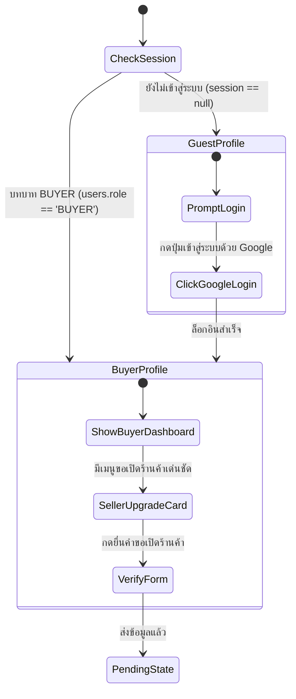

# 2NDHAND Marketplace (เดิมชื่อ Wondee) — คู่มือการออกแบบ UX/UI (อิงตาม inspection-mobile-design)

> ไฟล์ต้นแบบอินเตอร์แอคทีฟ (Interactive Prototype): [index.html](./index.html) ในโฟลเดอร์เดียวกับเอกสารนี้
> ปรับปรุงล่าสุด: 27 ก.ย. 2026

> ⚠️ **อัปเดต 29 ก.ย. 2026 — อ่านก่อน:** ชื่อแอปคือ **2NDHAND** (ไม่ใช่ Wondee) · โลโก้จริงอยู่ใน `logoAndSplash/` · **มาสคอตใช้เฉพาะรูปโปรไฟล์เริ่มต้น** (หัวข้อ 6–7 เรื่องมาสคอต/Wondee Inspect เป็นแนวคิดเก่า ไม่ใช้แล้ว) · หน้าตรวจสอบสินค้า/ใบรับรองใหม่ดู `UI-REDESIGN-PLAN.md` ข้อ 14–16 · ข้อตกลงและงานส่งต่อทั้งหมดยึด `UI-REDESIGN-PLAN.md` และ `HANDOFF-HEAD-DEV.md`

## 0. สถานะเอกสารและข้อจำกัด (อ่านก่อน)

| เรื่อง | สถานะ |
| :--- | :--- |
| สีหลัก | **เขียว Emerald** (`#10b981` / `#059669`) ใช้เป็นสีหลักของแบรนด์ต่อไป |
| แนวคิดบทบาท (role) | ✅ ตกลงแล้ว (28 ก.ย.): ทุกคนเข้ามาเป็นผู้ซื้อ ขายได้เมื่อยืนยันผู้ขายผ่าน และยังซื้อได้ · ผู้ซื้อ 3 แท็บ / ผู้ขาย 5 แท็บ (รายละเอียดใน `UI-REDESIGN-PLAN.md` ภาคผนวก A) · หัวข้อ 3 จะอัปเดตตอนแก้หน้าบัญชี |
| ชื่อแอป | **2NDHAND (Marketplace)** · โลโก้รอก่อน (ในต้นแบบยังเป็น "วนดี" จะเปลี่ยนตอนแก้แท็บล่าง/หัวหน้าจอ) |
| แบนเนอร์หน้าแรก | ภาพโฆษณาแบรนด์คงที่ กดแล้วไม่ไปไหน |
| Inspection flow (หัวข้อ 7) | เป็นดีไซน์อนาคต backend ตอนนี้มีแค่ค่าบริการตรวจ (`inspection_fee`) ยังไม่มี API คิวตรวจ/ผลตรวจ |
| หน้าจอที่ยังไม่มี | หน้าเปิดแอป (โลโก้, รอชื่อ/โลโก้จริง), หน้าลงขายสินค้า, หน้าค้นหาและหมวดหมู่แบบเต็มหน้า |
| การเปิดแบบ offline | ใช้ได้บางส่วน: Tailwind มีไฟล์ในเครื่องสำรองไว้ แต่ฟอนต์ (Google Fonts) และรูปสินค้า (Unsplash) ต้องใช้อินเทอร์เน็ต |

---

## 1. การอิง Style Design จาก `inspection-mobile-design`

เพื่อให้ระบบใน Ecosystem มีความสม่ำเสมอ (Consistency) ได้นำมาตรฐานการออกแบบจากต้นแบบ `inspection-mobile-design` (ไฟล์ต้นฉบับไม่ได้อยู่ในโฟลเดอร์นี้) มาปรับใช้ดังนี้:

### 1.1 Skeleton Loading: Shimmer Sweep Animation
นำระบบคลื่นแสงกวาดองศาเอียงแบบเดียวกับ inspection flow มาใช้ เพื่อความเนียนตาและป้องกัน Layout Shift:
```css
@keyframes shimmer-sweep {
  0% { background-position: -200% 0; }
  100% { background-position: 200% 0; }
}

/* สำหรับ Dark Mode */
.skeleton-shimmer {
  background: linear-gradient(90deg, rgba(255,255,255,0.03) 25%, rgba(255,255,255,0.12) 50%, rgba(255,255,255,0.03) 75%);
  background-size: 200% 100%;
  animation: shimmer-sweep 1.8s ease-in-out infinite;
}

/* สำหรับ Light Mode */
.light .skeleton-shimmer {
  background: linear-gradient(90deg, #e2e8f0 25%, #f8fafc 50%, #e2e8f0 75%) !important;
  background-size: 200% 100% !important;
  animation: shimmer-sweep 1.8s ease-in-out infinite !important;
}
```

### 1.2 โทนสีและ Layer พื้นผิว (Elevation & Dark/Light Themes)
| โทเค็นการออกแบบ | 🌙 Dark Mode (Default) | ☀️ Light Mode | การใช้งาน |
| :--- | :--- | :--- | :--- |
| **Canvas / Background** | `#0c0e14` (Deep Night Slate) | `#f8fafc` (Slate 50) | พื้นหลังหลักของหน้าจอแอป |
| **Card Surface** | `#161b26` (Slate 900) | `#ffffff` (Pure White) | การ์ดสินค้า, การ์ดสถานะ, กล่องโปรไฟล์ |
| **Inner Box / Container**| `#0f131c` (Slate 950) | `#f8fafc` / `#f1f5f9` | กล่องข้อมูลย่อย, ที่อยู่จัดส่ง, ชิปตัวเลือก |
| **Border Soft** | `#1e293b` (Slate 800) | `#e2e8f0` (Slate 200) | เส้นขอบบางเฉียบ เพื่อมิติที่ชัดเจน |
| **Primary Brand Accent** | `#10b981` (Emerald 500) | `#059669` (Emerald 600) | ปุ่มหลัก, ราคาเน้น, สัญลักษณ์ยืนยันแล้ว |
| **Primary Gradient Bar** | `#064e3b` -> `#10b981` | `#064e3b` -> `#10b981` | เส้นแถบแสดงความคืบหน้า (Progress Bar) |
| **Text Primary** | `#f8fafc` (High Contrast White)| `#0f172a` (Slate 900) | หัวข้อ, ชื่อสินค้า, ตัวเลขราคา |
| **Text Secondary** | `#94a3b8` (Slate 400) | `#64748b` (Slate 500) | คำอธิบาย, ชื่อแบรนด์, รายละเอียดรอง |

---

## 2. การแก้บัคช่องกรอกข้อความ (Form Input Contrast Bug Fix)

### ปัญหาเดิมที่พบ (จากภาพที่ผู้ใช้ส่งมา):
- เมื่ออุปกรณ์หรือเบราว์เซอร์อยู่ในโหมด Dark Mode (หรือมี Extension ปรับสี) ช่อง `<input>` ถูกบังคับพื้นหลังเป็นสีเทาเข้ม `#333333` แต่ข้อความยังคงใช้สีตัวอักษรเดิมที่เป็นสีน้ำเงินเข้ม/เทาเข้ม (`text-slate-800`) ทำให้ข้อความ **"ร้านวนดี วินเทจ คอลเลกชัน"** กลืนไปกับพื้นหลังจนมองไม่เห็น

### โซลูชันที่ได้รับการแก้ไข (Cross-Browser Contrast Protection):
กำหนดกฎ CSS แบบ Explicit Color & Autofill Protection ทั้ง Dark และ Light Mode:
```css
/* Dark Mode: พื้นหลังมืด #1e293b + ตัวหนังสือสว่าง #f8fafc คมชัด 100% */
#screenInside.dark input, #screenInside.dark textarea, #screenInside.dark select {
  background-color: #1e293b !important;
  border: 1.5px solid #334155 !important;
  color: #f8fafc !important;
  -webkit-text-fill-color: #f8fafc !important;
}

/* Light Mode: พื้นหลังขาว #ffffff + ตัวหนังสือดำเข้ม #0f172a คมชัด 100% */
#screenInside.light input, #screenInside.light textarea, #screenInside.light select {
  background-color: #ffffff !important;
  border: 1.5px solid #cbd5e1 !important;
  color: #0f172a !important;
  -webkit-text-fill-color: #0f172a !important;
}
```

---

## 3. ออกแบบ Flow หน้าโปรไฟล์ (Profile Architecture ตามโจทย์ข้อ 1)

> ⚠️ **รอตัดสินใจ:** แผนภาพนี้ยังใช้ `users.role == 'BUYER'` ซึ่งเป็นแนวคิดเดิม จะปรับให้ตรงกับข้อตกลง "1 บัญชีซื้อและขายได้" หลังได้รับอนุมัติ



### 3.1 หน้าโปรไฟล์สถานะ Guest (ยังไม่ได้ Login):
- **Hero Avatar:** สัญลักษณ์เงาผู้ใช้ 👤 พร้อมป้ายกำกับ `GUEST`
- **Call-to-Action ชัดเจน:** ข้อความแจ้ง *"ยังไม่ได้เข้าสู่ระบบ — เข้าสู่ระบบเพื่อดูคำสั่งซื้อ บันทึกของที่ถูกใจ และยื่นขอเปิดร้านค้า"*
- **Primary Button:** ปุ่มสีเขียวเด่นสะดุดตา **"เข้าสู่ระบบด้วย Google"**
- **Secondary Links:** ลิงก์ไปยังศูนย์ช่วยเหลือ และนโยบายความเป็นส่วนตัว (PDPA)

### 3.2 หน้าโปรไฟล์สถานะ Buyer (ผู้ซื้อทั่วไป):
- **User Header:** รูปโปรไฟล์, ชื่อ-นามสกุล, ป้ายกำกับ `BUYER`, วันที่สมัครสมาชิก และสถานะยืนยันอีเมล *(ไม่มีคะแนนรีวิว เนื่องจากบทบาท Buyer ยังไม่มีการรีวิว)*
- **⭐ เมนูขอเปิดร้านค้า (Prominent Seller Upgrade Card):**
  - ดีไซน์ปรับสีตามโหมด (Theme Adaptive):
    - **Light Mode:** โทนสีเขียวมิ้นต์อ่อน (`#ecfdf5` ไล่ไป `#ffffff`), ขอบการ์ดสีเขียวพาสเทล (`#a7f3d0`), ตัวหนังสือเขียวมรกตเข้มอ่านชัดเจน (`#064e3b`)
    - **Dark Mode:** โทนสีเขียวมรกตเข้มตัด Slate (`rgba(6, 78, 59, 0.6)` ไล่ไป `#161b26`), ขอบนีออนมรกตนุ่มนวล
  - หัวข้อ: **"ต้องการเปิดร้านขายสินค้า?"**
  - รายละเอียด: *"ยกระดับบัญชีเป็นผู้ขาย ส่งต่อของรัก สร้างรายได้ง่ายๆ พร้อมระบบคุ้มครอง"*
  - ปุ่ม Action ด่วน: **"ขอเปิดร้านค้า"** (เมื่อแตะแล้วจะเปิดแบบฟอร์มยืนยันตัวตน `verify-form` ทันที)
- **ประวัติและรายการโปรด:** เคาน์เตอร์คำสั่งซื้อ (2 รายการ), สินค้าที่ถูกใจ, และที่อยู่จัดส่ง

---

## 4. สรุปรายการปรับปรุงล่าสุด (5 รายการตามฟีดแบ็ก)

| รายการที่ปรับปรุง | ก่อนปรับปรุง | หลังปรับปรุงใน Prototype |
| :--- | :--- | :--- |
| **1. สีบัตรขอเปิดร้านใน Light Theme** | บัตรสีดำเข้มขัดกับพื้นหลังขาว | ใช้โทน Gradient เขียวมินต์พาสเทล (`#ecfdf5`) สบายตา ตัวหนังสือเข้มอ่านง่าย |
| **2. คะแนนรีวิวในโปรไฟล์ Buyer** | มีป้ายคะแนนรีวิว `⭐ 4.9 (18 รีวิว)` | นำคะแนนรีวิวออก คงเหลือเฉพาะสถานะ `BUYER` และการยืนยันตัวตน |
| **3. ป้ายสภาพสินค้า** | ระบุเป็นเปอร์เซ็นต์ เช่น `สภาพดีมาก (98%)` | เปลี่ยนเป็นคำบอกสภาพมาตรฐาน เช่น `สภาพดีมาก`, `สภาพเหมือนใหม่` ไร้เครื่องหมาย `%` |
| **4. นำปุ่มแชตออก** | มีปุ่ม `💬 แชต` ข้างปุ่มซื้อสินค้า | นำปุ่มแชตออกตามขอบเขตงาน ขยายปุ่ม `ซื้อสินค้าทันที` ให้โดดเด่นเข้าถึงง่าย |
| **5. Skeleton Loading ใน Light Theme** | แอนิเมชันไม่ขยับ/มองไม่เห็นการเคลื่อนไหว | ปรับใช้ CSS `::after` GPU Transform sweep กวาดแสงขาวผ่านพื้น Slate-300 คมชัด 60fps |

---

## 5. วิธีทดสอบใน Prototype

🔗 **เปิดดูไฟล์ Prototype:** ดับเบิลคลิก [index.html](./index.html) (เลือกหน้าจอจากเมนูด้านซ้าย หรือแถบชิปด้านบนเมื่อจอแคบ)

### การทดสอบจุดสำคัญ:
1. **ทดสอบ Dark / Light Mode:** กดปุ่ม `🌙 Dark` หรือ `☀️ Light` ที่แถบด้านบนเพื่อดูการสลับธีมแบบสมบูรณ์
2. **ทดสอบสีบัตรขอเปิดร้านค้า & ข้อมูลโปรไฟล์:** 
   - กดเมนู **"👤 โปรไฟล์ Buyer (มีปุ่มขอเปิดร้าน)"**
   - สลับระหว่าง Light และ Dark Mode: สังเกตว่าบัตรขอเปิดร้านค้าเปลี่ยนโทนสีเป็นเขียวมินต์สว่างเข้ากับธีมขาวอย่างลงตัว
   - สังเกตว่าส่วนหัว Buyer ไม่มีคะแนนดาวรีวิวแล้ว
3. **ทดสอบ Skeleton Loading:** กดปุ่ม **"Skeleton"** ในกล่อง "โหมดแสดงผล Loading" ทั้งโหมด Light และ Dark จะเห็นคลื่นแสง Shimmer Sweep ไหลผ่านการ์ดสินค้าอย่างชัดเจน
4. **ทดสอบหน้าสินค้าและสั่งซื้อ:** 
   - กดเมนู **"🔍 หน้ารายละเอียดสินค้า (Detail)"** ตรวจสอบป้ายสภาพสินค้า `สภาพดีมาก` (ไม่มี %) และด้านล่างไม่มีปุ่มแชต มีเพียงปุ่ม `ซื้อสินค้าทันที`
   - กดปุ่ม **"ซื้อสินค้าทันที"** ไปยังหน้า **"ยืนยันการสั่งซื้อ"** ตรวจสอบป้าย `สภาพเหมือนใหม่` (ไม่มี %)
5. **ทดสอบบัคช่องกรอกข้อความ:** ไปที่เมนู **"📝 แบบฟอร์มขอเปิดร้าน"** ตรวจสอบว่าช่อง *"ชื่อร้านค้า"* มีตัวหนังสือคมชัดอ่านง่ายทุกธีม
6. **ทดสอบไอเดียมาสคอต (Mascot Showcase):** 
   - กดปุ่ม **"👾 ไอเดียมาสคอต (Showcase)"** บนแถบเลื่อนบนสุด หรือแถบเมนูด้านซ้าย
   - ชมมาสคอตเรขาคณิตแอนิเมชันขยับตากะพริบ
   - ทดลองกดปุ่มเปลี่ยน Avatar ของคุณสมชายแบบ Real-time และดูการ์ด Inspector / Empty State
7. **ทดสอบ Pull-to-Refresh:** เปิด **"🛍️ หน้ารายการสินค้า"** หรือ **"📦 รายการคำสั่งซื้อ"** เลื่อนขึ้นบนสุด แล้วคลิกค้าง/แตะลากลงประมาณ 1 นิ้วแล้วปล่อย
   - ไอคอนวงกลมสีเขียวหมุนตามระยะที่ลาก ถ้าลากไม่ถึงเกณฑ์จะเด้งกลับ
   - ถ้าถึงเกณฑ์จะหมุนค้าง ~1.2 วินาที หน้ารายการสินค้าจะแสดง skeleton ระหว่างโหลด แล้วกลับเป็นเนื้อหาเดิม

---

## 6. สรุปแนวคิดการออกแบบมาสคอต (Tech-Minimalist Geometric Blobs)

> ภาพแรงบันดาลใจของมาสคอตไม่ได้แนบมาในโฟลเดอร์นี้ ดูตัวจริงได้ที่ [mascot_showcase.html](./mascot_showcase.html)

### 6.1 จุดเด่นของสไตล์ในภาพ (Visual Anatomy):
- **รูปทรงเรขาคณิตโค้งมน (Geometric Organic Shapes):** หยดน้ำ (Drop), วงรีแคปซูล (Pill), ทรงเหลี่ยมมน (Squircle), สามเหลี่ยมมน (Pebble) และวงกลม (Circle)
- **จุดตาสองจุดสุดมินิมอล (Dot Eyes):** มีเพียงดวงตาสีเข้ม 2 ขีด/จุด ทำให้ดูน่าเอ็นดู เข้าถึงง่าย โดยไม่ทำให้แอปดูเด็กจนเสียภาพลักษณ์ความน่าเชื่อถือ
- **SVG Code 100%:** น้ำหนักเบาเพียงหลักร้อยไบต์ คมชัดทุกความละเอียดหน้าจอ และทำ CSS Eye-blink animation ได้ลื่นไหล

### 6.2 สี่แนวทางการนำไปใช้งานใน Wondee โดยไม่กระทบดีไซน์เดิม:
1. **🌟 Default Avatar Generator (แนะนำสูงสุด):**
   - ผู้ใช้ที่ไม่ได้อัปโหลดรูปจริง แทนที่จะเห็นไอคอนหัวคนสีเทาแบนๆ `👤` ระบบจะสุ่มหรือให้เลือกมาสคอตเรขาคณิต (หยดน้ำวนดี, แคปซูลมินต์, กล่องพัสดุม่วง, ฯลฯ)
   - *ผลกระทบต่อดีไซน์เดิม: 0%* เพราะอยู่ในกรอบ Avatar กลมขนาดเท่าเดิม
2. **🛡️ Wondee Inspector Badge:**
   - ตัวแทนฝ่ายตรวจสภาพสินค้าในหน้า Timeline ออเดอร์และกล่องรับประกัน Escrow
   - สร้างความสบายใจและรอยยิ้มในการซื้อของมูลค่าสูง
3. **📦 Empty State Companions:**
   - ปรากฏเฉพาะหน้าจอที่ยังไม่มีข้อมูล (เช่น ยังไม่มีออเดอร์, ค้นหาไม่พบ)
   - *ผลกระทบต่อดีไซน์เดิม: 0%* เพราะหน้าที่มีสินค้าจะไม่แสดงมาสคอตเลย
4. **💬 Micro-Feedback & Toast Alerts:**
   - หน้าน้องมาสคอตวิ้งค์ตาแสดงขึ้นมาสั้นๆ 2 วินาทีเมื่อคัดลอกเลขพัสดุสำเร็จ หรือบันทึกข้อมูลเรียบร้อย

### 6.3 การนำมาสคอตไปแทนปุ่ม Navigation Bar 'ฉัน' พร้อมแอนิเมชันกระพริบตา (Blinking Navigation Mascot)
- **ตำแหน่ง:** ปุ่มแท็บ Navigation Bar ล่างสุด 'ฉัน' (Profile / Me)
- **Active State (เมื่ออยู่หน้า Profile):** ตัวมาสคอตหยดน้ำสีเขียว Emerald Solid (`fill="currentColor"`) ดวงตาสีเข้ม `#022c22`
- **Inactive State (เมื่ออยู่หน้าอื่น เช่น หน้าแรก, คำสั่งซื้อ):** ตัวมาสคอตหยดน้ำแบบเส้น Outline มินิมอล (`stroke="currentColor" fill="none"`) ดวงตาสีเดียวกับไอคอน
- **Eye-Blink Animation (การกระพริบตา):**
  - **เทคนิคการเรนเดอร์:** ผสมผสาน Native SVG SMIL `<animate attributeName="ry">` และ CSS `@keyframes navMascotEyeBlink` ยุบ-ขยายความสูงรอบจุดกึ่งกลางดวงตา (cx, cy) ทำให้ไม่หลุดกรอบและไม่กระตุก 100%
  - **จังหวะ Double-Blink (2.5s cadence):** ลืมตาปกติ (0 - 72%) -> หลับตาครั้งที่ 1 (78%) -> ลืมตาเร็ว (84%) -> หลับตาครั้งที่ 2 (90%) -> ลืมตาปกติ (100%) ให้น้องมีความมีชีวิตชีวาและดึงดูดสายตาอย่างน่ารักเป็นธรรมชาติ

---

## 7. การรวมระบบตรวจสอบสินค้า (Inspection Flow Integration & Mascot Placements)

เป็นการหลอมรวมฟีเจอร์จากต้นแบบ `inspection-mobile-design` เข้ากับดีไซน์ระบบ Marketplace ล่าสุด โดยคงสเปกสี Contrast สูง, Shimmer Skeleton Sweeping, และรองรับทั้ง Light Theme & Dark Theme 100%

### 7.1 หน้าจอที่ผสานเข้ามาใน Prototype (ทั้ง 4 หน้า):
1. **🚚 ผู้ขายส่งสินค้าเข้าศูนย์ตรวจ (`screen-seller-ship`):**
   - สถานะ `WAITING_SELLER_SHIP` -> กรอกเลข Tracking พร้อม Dropdown ขนส่ง (ไปรษณีย์ไทย, Flash, Kerry, J&T, SPX)
   - **Mascot Placement #1 (Courier Wondee):** กล่องคำแนะนำการแพ็คพัสดุ มีมาสคอตสวมหมวกไปรษณีย์ถือกล่องพัสดุและกระพริบตา แนะนำการห่อบับเบิ้ล 3 ชั้นและการบันทึกวิดีโอแกะกล่อง 4K
   - ไทม์ไลน์จำลองสถานะการส่งหลังกดยืนยัน พร้อมปุ่มลิงก์สลับไปดูฝั่ง Inspector

2. **🛡️ ผู้ซื้อดูผลการตรวจ & ใบรับรอง E-Cert (`screen-buyer-result`):**
   - สถานะ `RESULT_NOTIFIED` จำลองผลตรวจ 4 ระดับ (PASS, MINOR_ISSUE, NOT_AS_DESCRIBED, FAKE)
   - **Mascot Placement #2 (Dynamic Outcome Reactions):** ตัวมาสคอตและกล่องคำพูดจะเปลี่ยนตามผลตรวจแบบเรียลไทม์:
     - `PASS`: มาสคอตสีเขียวมรกตพร้อมมงกุฎช่อมะกอกและดาวทอง *"วนดีการันตี! ตรวจแล้วของแท้ 100% สภาพสมบูรณ์ สบายใจได้เลย"*
     - `MINOR_ISSUE`: มาสคอตสีส้มอำพันสวมแว่นตาตรวจสอบ *"วนดีพบรอยขนแมวเล็กน้อยตามการใช้งาน แต่เป็นของแท้ 100% แน่นอน"*
     - `NOT_AS_DESCRIBED`: มาสคอตสีส้มถือแว่นขยายเอียงคอสงสัย พร้อมเครื่องหมายตกใจ *"วนดีตรวจพบของไม่ตรงตามประกาศ (ขาดสายชาร์จแท้)"*
     - `FAKE`: มาสคอตสีแดงสดถือโล่ Escrow คุ้มครองเงิน *"วนดีตรวจพบสินค้าปลอมแปลง! ระบบ Escrow คุ้มครองเงิน 100% กดรับเงินคืนได้ทันที"*
   - แกลเลอรีรูปหลักฐาน 4 รูป กดแตะซูมดูรูปใหญ่ได้ (`imageModal`)

3. **📋 คิวงานเจ้าหน้าที่ศูนย์ตรวจ (`screen-inspector-queue`):**
   - เส้นทาง `/inspections` คัดกรองงาน 4 แท็บ (ทั้งหมด 5 รายการ, รอรับพัสดุ 2, กำลังตรวจ 1, ตรวจแล้ว 2)
   - **Mascot Placement #3 (Inspector Wondee Detective):** ส่วนหัวของ Inspector Profile ใช้มาสคอตวนดีสวมหมวกนักสืบและแว่นส่องขยายทองเหลือง รหัสผู้ตรวจ `INS-042 (สารวัตรวนดี)` พร้อมบทสนทนาต้อนรับ

4. **🔬 เวิร์กโฟลว์การตรวจ 3 สเต็ป (`screen-inspector-work`):**
   - เส้นทาง `/inspections/[id]`
   - แถบ Progress สีเขียวไล่เฉด (Gradient Green: Dark Green -> Normal Green)
   - สเต็ป 1: รับพัสดุเข้าศูนย์ (ตรวจสภาพกล่องและเลข Tracking)
   - **Mascot Placement #4 (Inspection Desk Standard):** สเต็ป 2 เริ่มการตรวจ มีภาพมาสคอตหน้าโต๊ะตรวจโคมไฟ 1,000 Lux และคำแนะนำบันทึกวิดีโอ 60fps ก่อนกรีดเทปกล่อง
   - สเต็ป 3: เลือกผล 4 ระดับ, กล่องบันทึกผล 10-2,000 ตัวอักษรพร้อมตัวนับสด, และแนบรูป 1-5 รูป พร้อมปุ่มส่งผลออกใบรับรอง

5. **📜 ตราประทับโฮโลแกรมมาสคอตบน E-Certificate (`certificateModal`):**
   - **Mascot Placement #5 (Official Hologram Seal):** เหรียญตราประทับทองคำ-มรกตล้อมรอบตัวมาสคอตวนดี พร้อมคำว่า `WONDEE AUTHENTICATED • VERIFIED` สร้างความน่าเชื่อถือระดับสากลและระบบสแกน QR Code ตรวจสอบบนฐานข้อมูลศูนย์

### 7.2 จุดเชื่อมโยงข้ามหน้าจอ (Seamless Cross-Linking):
- จากหน้า **โปรไฟล์ Buyer (`screen-profile-buyer`)**: มีการ์ด **"Wondee Inspection Hub"** ให้สลับไปยังมุมมองผู้ขายส่งตรวจ, ผู้ซื้อดูผล, หรือคิวงานเจ้าหน้าที่ตรวจได้ทันที
- จากหน้า **รายการคำสั่งซื้อ (`screen-orders-list`)**: ออเดอร์หูฟัง Sony มีป้าย `🛡️ ตรวจรับรองแล้ว (PASS) [ดูใบรับรอง E-Cert]` คลิกแล้วข้ามไปยังหน้าผลตรวจได้ในคลิกเดียว
- จากหน้า **Timeline คำสั่งซื้อ (`screen-order-detail`)**: สเต็ปที่ 3 ของน้องวนดีตรวจสินค้า มีปุ่ม `🛡️ ดูผลตรวจสภาพและใบรับรอง E-Cert` ข้ามไปยังหน้าผลตรวจได้ทันที

---

## 8. Pull-to-Refresh (ลากลงเพื่อรีเฟรช)

**ใช้ที่:** หน้ารายการสินค้า และหน้ารายการคำสั่งซื้อ (container ที่มี `data-ptr`)

| สเปก | ค่า |
| :--- | :--- |
| เกณฑ์ที่ต้องลากถึง | 64px (หลังหักแรงต้าน 0.8) ลากได้สูงสุด 110px |
| การเลื่อนของเนื้อหา | 60% ของระยะที่ลาก |
| ไอคอน | วงกลม 36px พื้นการ์ด (`#161b26` / `#ffffff`) ลูกศรวนสี Emerald หมุนตามระยะลาก (3°/px) |
| ระหว่างโหลด | ไอคอนหมุนต่อเนื่อง 0.8s/รอบ, เนื้อหาค้างที่ 52px, หน้ารายการสินค้าแสดง skeleton |
| ปล่อยก่อนถึงเกณฑ์ / โหลดเสร็จ | เด้งกลับ 280ms `cubic-bezier(.2,.8,.2,1)` |

**สำหรับ implement ใน React Native (หัวหน้าทีม):** ใช้ `RefreshControl` บน `FlatList`/`ScrollView` ของหน้า `/products` และ `/orders` ตั้ง `tintColor` (iOS) และ `colors` (Android) เป็นสีหลัก Emerald แล้วเรียก `refresh()` ของ store ที่มีอยู่ ระหว่างโหลดใช้ skeleton แทนวงกลมหมุนกลางจอ

